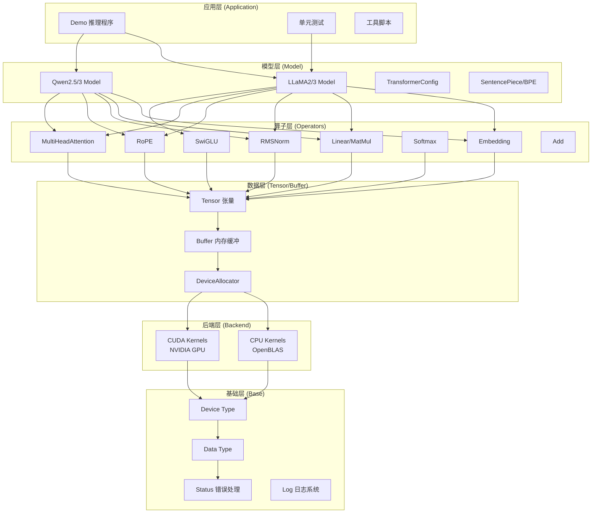
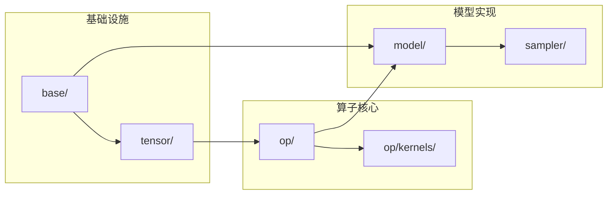
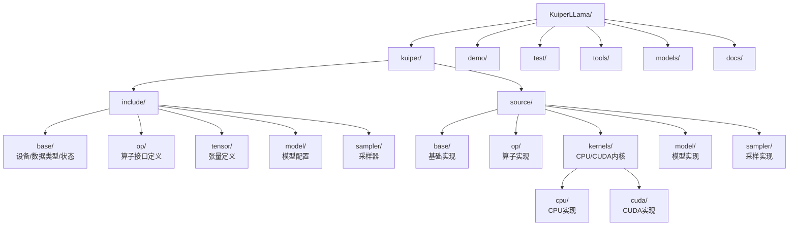
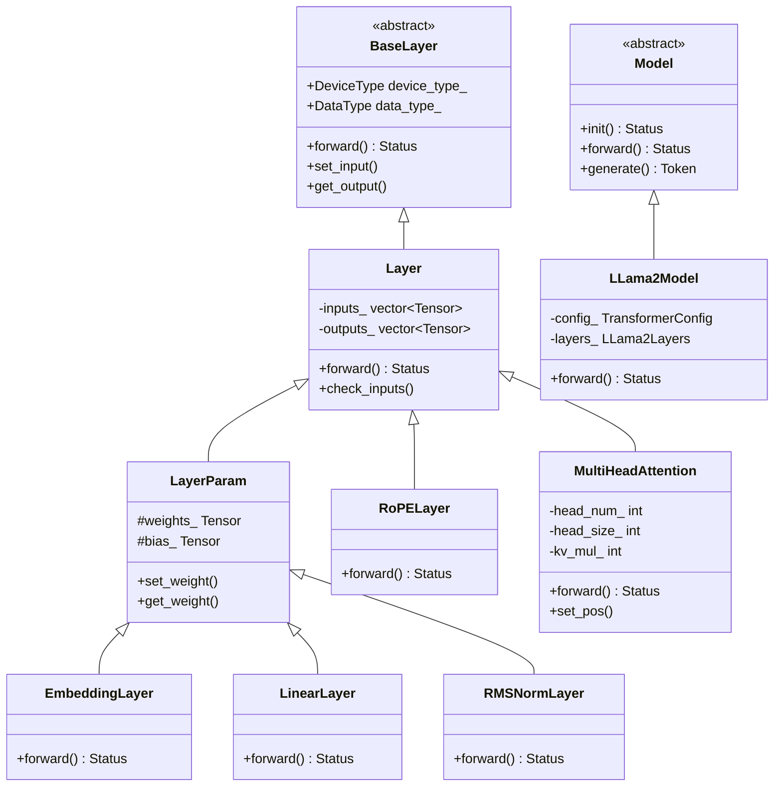
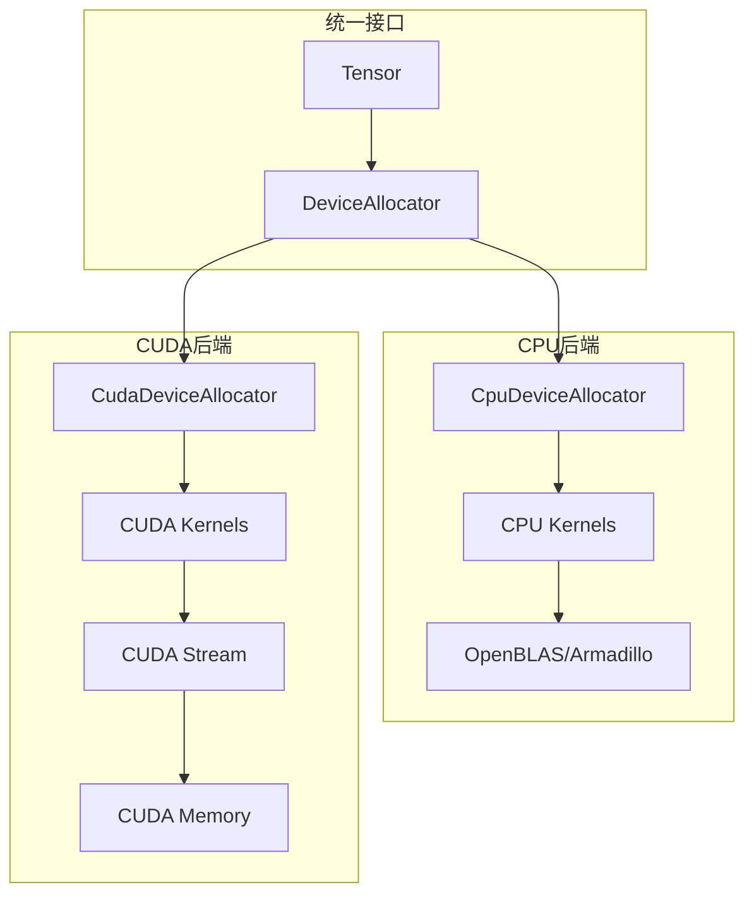
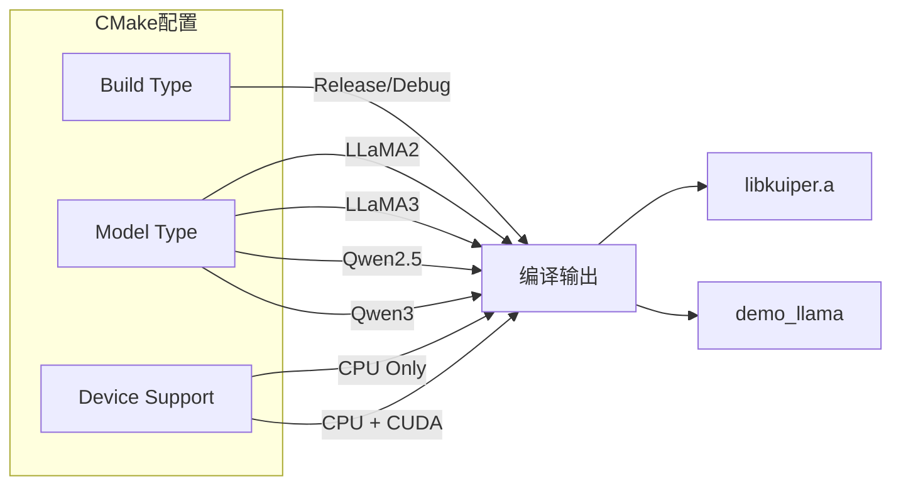

# KuiperLLama 整体架构图

## 1. 系统分层架构

```mermaid
graph TB
    subgraph 应用层["应用层 (Application)"]
        DEMO[Demo 推理程序]
        TEST[单元测试]
        TOOLS[工具脚本]
    end

    subgraph 模型层["模型层 (Model)"]
        LLAMA[LLaMA2/3 Model]
        QWEN[Qwen2.5/3 Model]
        CONFIG[TransformerConfig]
        TOKENIZER[SentencePiece/BPE]
    end

    subgraph 算子层["算子层 (Operators)"]
        EMB[Embedding]
        LINEAR[Linear/MatMul]
        RMS[RMSNorm]
        ROPE[RoPE]
        MHA[MultiHeadAttention]
        SOFTMAX[Softmax]
        SWIGLU[SwiGLU]
        ADD[Add]
    end

    subgraph 数据层["数据层 (Tensor/Buffer)"]
        TENSOR[Tensor 张量]
        BUFFER[Buffer 内存缓冲]
        ALLOC[DeviceAllocator]
    end

    subgraph 基础层["基础层 (Base)"]
        DEVICE[Device Type]
        DTYPE[Data Type]
        STATUS[Status 错误处理]
        LOG[Log 日志系统]
    end

    subgraph 后端层["后端层 (Backend)"]
        CPU[CPU Kernels<br/>OpenBLAS]
        CUDA[CUDA Kernels<br/>NVIDIA GPU]
    end

    DEMO --> LLAMA
    DEMO --> QWEN
    TEST --> LLAMA

    LLAMA --> EMB
    LLAMA --> LINEAR
    LLAMA --> RMS
    LLAMA --> ROPE
    LLAMA --> MHA
    LLAMA --> SWIGLU

    QWEN --> EMB
    QWEN --> LINEAR
    QWEN --> RMS
    QWEN --> ROPE
    QWEN --> MHA

    EMB --> TENSOR
    LINEAR --> TENSOR
    RMS --> TENSOR
    ROPE --> TENSOR
    MHA --> TENSOR
    SOFTMAX --> TENSOR
    SWIGLU --> TENSOR

    TENSOR --> BUFFER
    BUFFER --> ALLOC

    ALLOC --> CPU
    ALLOC --> CUDA

    CPU --> DEVICE
    CUDA --> DEVICE
    DEVICE --> DTYPE
    DTYPE --> STATUS
```

## 2. 核心模块依赖关系

```mermaid
graph LR
    subgraph 基础设施
        BASE[base/]
        TENSOR[tensor/]
    end

    subgraph 算子核心
        OP[op/]
        KERNELS[op/kernels/]
    end

    subgraph 模型实现
        MODEL[model/]
        SAMPLER[sampler/]
    end

    BASE --> TENSOR
    TENSOR --> OP
    OP --> KERNELS
    BASE --> MODEL
    OP --> MODEL
    MODEL --> SAMPLER
```

## 3. 目录结构与模块划分

```mermaid
graph TD
    ROOT[KuiperLLama/] --> KUIPER[kuiper/]
    ROOT --> DEMO[demo/]
    ROOT --> TEST[test/]
    ROOT --> TOOLS[tools/]
    ROOT --> MODELS[models/]
    ROOT --> DOCS[docs/]

    KUIPER --> INCLUDE[include/]
    KUIPER --> SOURCE[source/]

    INCLUDE --> IBASE[base/<br/>设备/数据类型/状态]
    INCLUDE --> IOP[op/<br/>算子接口定义]
    INCLUDE --> ITENSOR[tensor/<br/>张量定义]
    INCLUDE --> IMODEL[model/<br/>模型配置]
    INCLUDE --> ISAMPLER[sampler/<br/>采样器]

    SOURCE --> SBASE[base/<br/>基础实现]
    SOURCE --> SOP[op/<br/>算子实现]
    SOURCE --> SKERNELS[kernels/<br/>CPU/CUDA内核]
    SOURCE --> SMODEL[model/<br/>模型实现]
    SOURCE --> SSAMPLER[sampler/<br/>采样实现]

    SKERNELS --> CPUK[cpu/<br/>CPU实现]
    SKERNELS --> CUDAK[cuda/<br/>CUDA实现]
```

## 4. 类层次结构

```mermaid
classDiagram
    class BaseLayer {
        <<abstract>>
        +DeviceType device_type_
        +DataType data_type_
        +forward() Status
        +set_input()
        +get_output()
    }

    class Layer {
        -inputs_ vector~Tensor~
        -outputs_ vector~Tensor~
        +forward() Status
        +check_inputs()
    }

    class LayerParam {
        #weights_ Tensor
        #bias_ Tensor
        +set_weight()
        +get_weight()
    }

    class EmbeddingLayer {
        +forward() Status
    }

    class LinearLayer {
        +forward() Status
    }

    class RMSNormLayer {
        +forward() Status
    }

    class RoPELayer {
        +forward() Status
    }

    class MultiHeadAttention {
        -head_num_ int
        -head_size_ int
        -kv_mul_ int
        +forward() Status
        +set_pos()
    }

    class Model {
        <<abstract>>
        +init() Status
        +forward() Status
        +generate() Token
    }

    class LLama2Model {
        -config_ TransformerConfig
        -layers_ LLama2Layers
        +forward() Status
    }

    BaseLayer <|-- Layer
    Layer <|-- LayerParam
    LayerParam <|-- EmbeddingLayer
    LayerParam <|-- LinearLayer
    LayerParam <|-- RMSNormLayer
    Layer <|-- RoPELayer
    Layer <|-- MultiHeadAttention
    Model <|-- LLama2Model
```

## 5. 设备抽象架构

```mermaid
graph TB
    subgraph 统一接口
        ALLOC[DeviceAllocator]
        TENSOR[Tensor]
    end

    subgraph CPU后端
        CPU_ALLOC[CpuDeviceAllocator]
        CPU_KERNELS[CPU Kernels]
        BLAS[OpenBLAS/Armadillo]
    end

    subgraph CUDA后端
        CUDA_ALLOC[CudaDeviceAllocator]
        CUDA_KERNELS[CUDA Kernels]
        STREAM[CUDA Stream]
        CUDAMEM[CUDA Memory]
    end

    ALLOC --> CPU_ALLOC
    ALLOC --> CUDA_ALLOC

    TENSOR --> ALLOC

    CPU_ALLOC --> CPU_KERNELS
    CPU_KERNELS --> BLAS

    CUDA_ALLOC --> CUDA_KERNELS
    CUDA_KERNELS --> STREAM
    STREAM --> CUDAMEM
```

## 6. 编译配置选项

```mermaid
graph LR
    subgraph CMake配置
        BUILD_TYPE[Build Type]
        MODEL_TYPE[Model Type]
        DEVICE[Device Support]
    end

    BUILD_TYPE --> |Release/Debug| COMPILE[编译输出]

    MODEL_TYPE --> |LLaMA2| COMPILE
    MODEL_TYPE --> |LLaMA3| COMPILE
    MODEL_TYPE --> |Qwen2.5| COMPILE
    MODEL_TYPE --> |Qwen3| COMPILE

    DEVICE --> |CPU Only| COMPILE
    DEVICE --> |CPU + CUDA| COMPILE

    COMPILE --> LIB[libkuiper.a]
    COMPILE --> DEMO[demo_llama]
```
