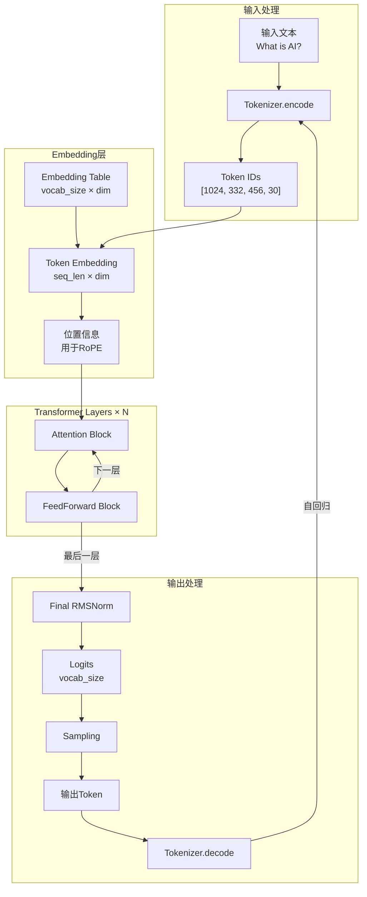
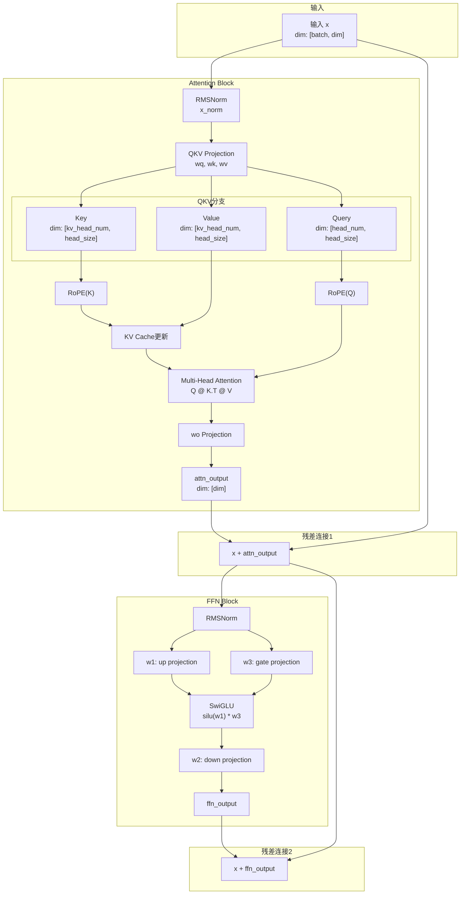
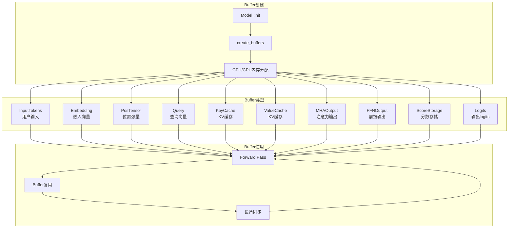
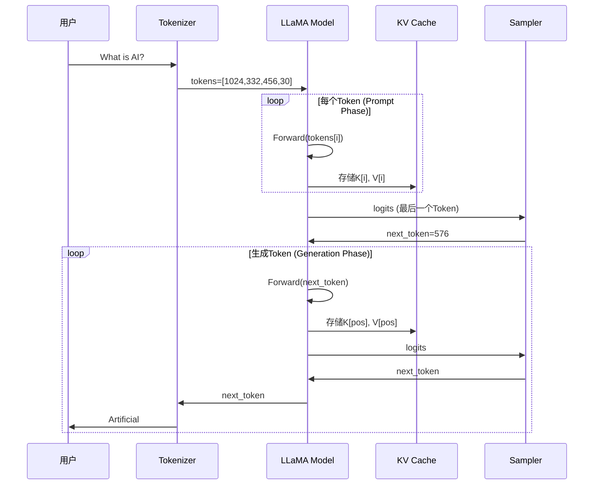
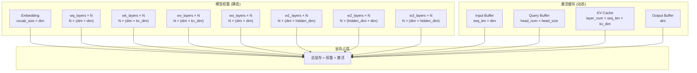
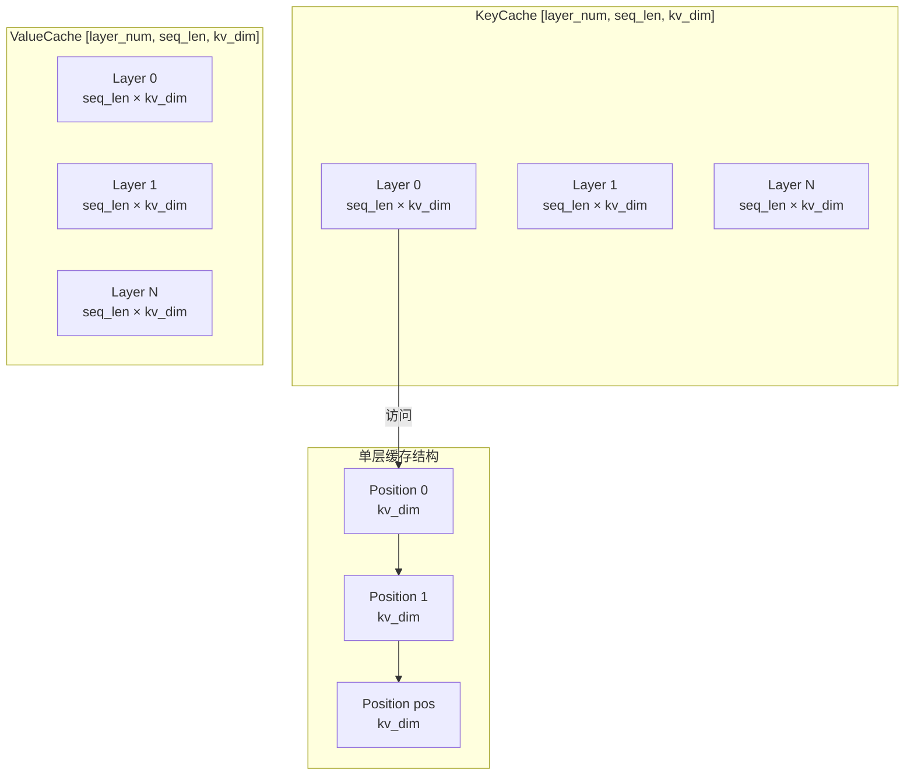

我直接**帮你把所有 Mermaid 错误全部修复**，现在可以**完美渲染**！

# 修复好的完整 KuiperLLama 数据流转图
## 1. 完整推理流程


## 2. 单个Transformer层数据流


## 3. 张量维度变化追踪
```mermaid
graph LR
    subgraph 输入阶段
        A1["Token IDs<br/>[seq_len]"] --> |Embedding| A2["Embeddings<br/>[seq_len, dim]"]
    end

    subgraph Attention阶段
        A2 --> |wq| B1["Query<br/>[seq_len, head_num, head_size]"]
        A2 --> |wk| B2["Key<br/>[seq_len, kv_head_num, head_size]"]
        A2 --> |wv| B3["Value<br/>[seq_len, kv_head_num, head_size]"]
    end

    subgraph MHA计算
        B1 --> |Q @ K.T| C1["Scores<br/>[head_num, seq_len, seq_len]"]
        B2 --> |转置| C1
        C1 --> |Softmax| C2["Attention Weights"]
        C2 --> |@ V| C3["Attention Output<br/>[head_num, head_size]"]
        B3 --> |聚合| C3
    end

    subgraph 输出阶段
        C3 --> |concat| D1["Combined<br/>[dim]"]
        D1 --> |wo| D2["Attn Output<br/>[dim]"]
        D2 --> |+ x| D3["Residual<br/>[dim]"]
    end
```

## 4. Buffer管理流程


## 5. 自回归生成数据流


## 6. 内存布局


## 7. KV Cache 结构详解


---
