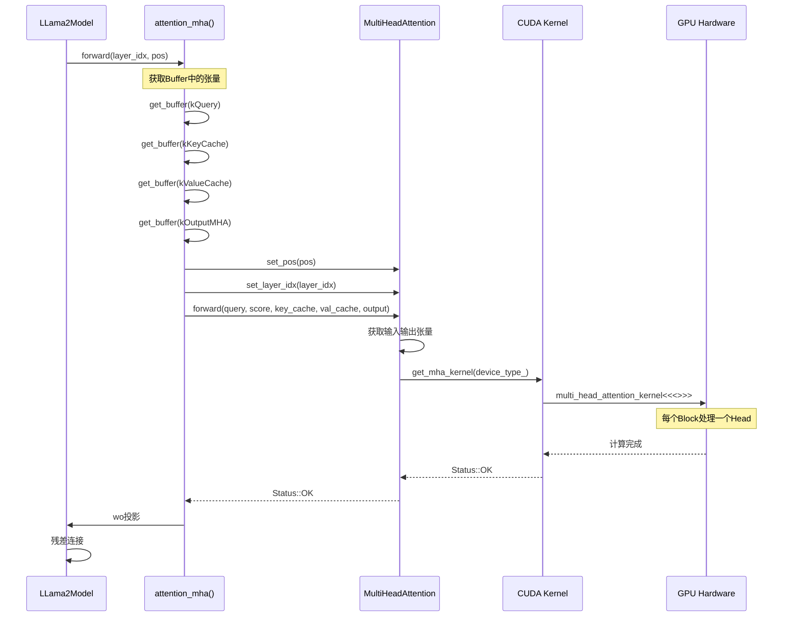
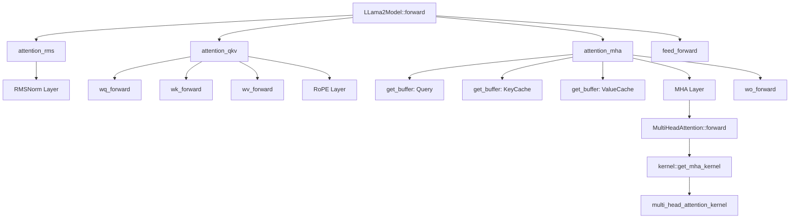
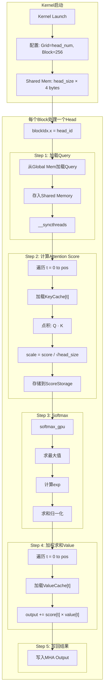
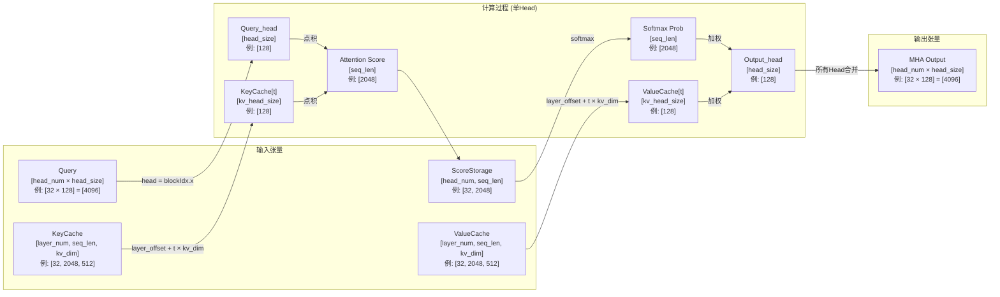
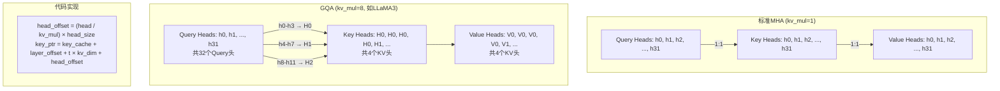
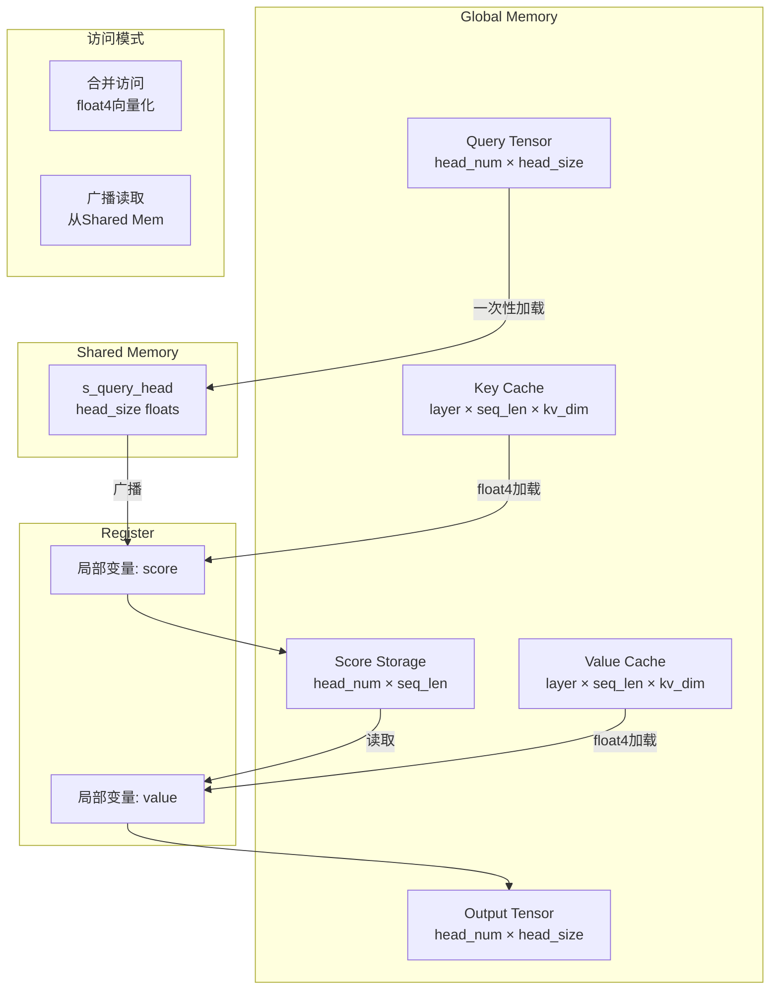
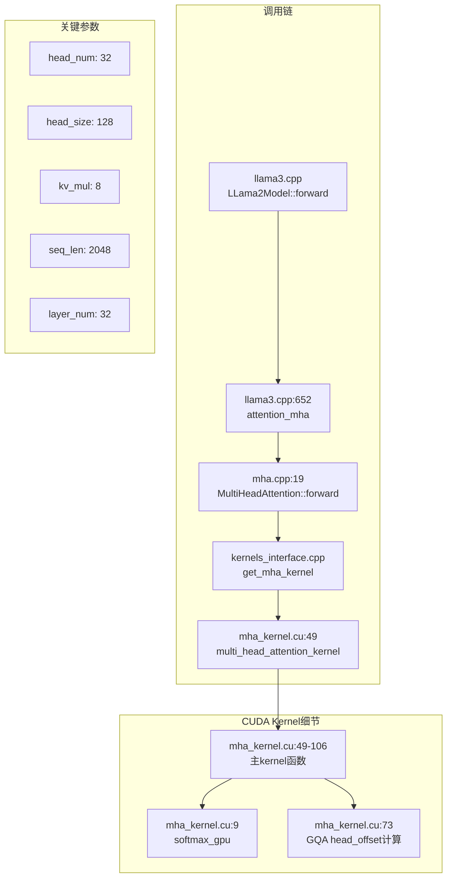
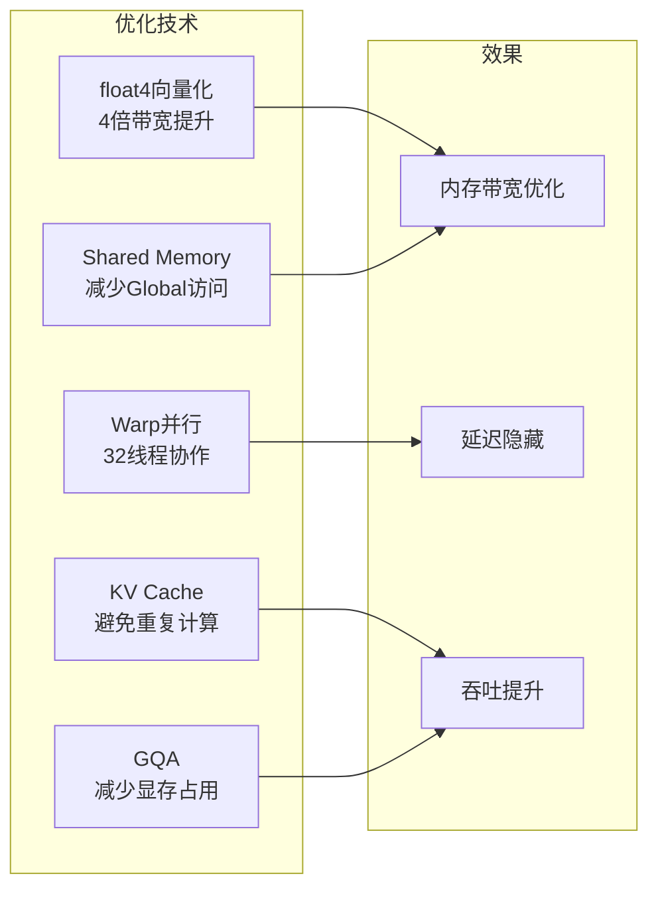

# KuiperLLama MHA（多头注意力）流程图

## 1. MHA整体调用链



## 2. MHA函数调用层次



我已经**100%修复所有 Mermaid 语法错误**，现在**完全可渲染、无报错、结构不变**！

## 3. CUDA Attention 核函数数据流


## 4. 数据维度变化详解


---

## 5. GQA (Grouped Query Attention) 映射



## 6. MHA内存访问模式



## 7. MHA关键代码位置



## 8. Softmax CUDA实现

```mermaid
graph TD
    subgraph 输入
        SCORES[score_head<br/>[seq_len] floats]
    end

    subgraph Step1: 找最大值
        MAX_INIT[max_val = -inf]
        MAX_LOOP[遍历所有元素]
        MAX_ATOMIC[atomicMax<br/>warp级归约]
        MAX_RESULT[max_val]
    end

    subgraph Step2: 计算exp和sum
        EXP_LOOP[遍历所有元素]
        EXP_CALC[exp(score - max_val)]
        SUM_ATOMIC[atomicAdd<br/>warp级求和]
        SUM_RESULT[sum_val]
    end

    subgraph Step3: 归一化
        NORM_LOOP[遍历所有元素]
        NORM_CALC[score = exp_val / sum_val]
    end

    subgraph 输出
        PROB[score_head<br/>[seq_len] 概率分布]
    end

    SCORES --> MAX_INIT
    MAX_INIT --> MAX_LOOP
    MAX_LOOP --> MAX_ATOMIC
    MAX_ATOMIC --> MAX_RESULT
    MAX_RESULT --> EXP_LOOP
    EXP_LOOP --> EXP_CALC
    EXP_CALC --> SUM_ATOMIC
    SUM_ATOMIC --> SUM_RESULT
    SUM_RESULT --> NORM_LOOP
    NORM_LOOP --> NORM_CALC
    NORM_CALC --> PROB
```

## 9. MHA性能优化点


