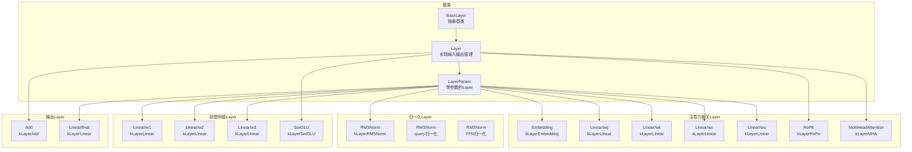
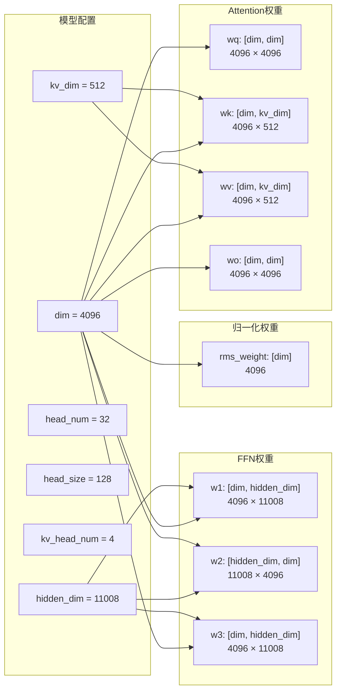
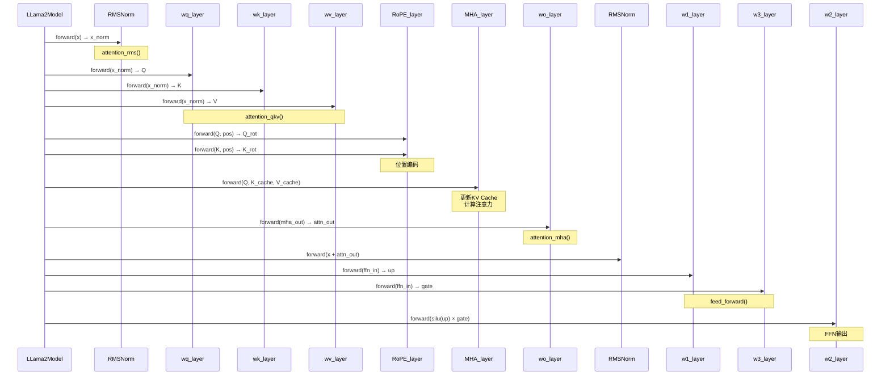
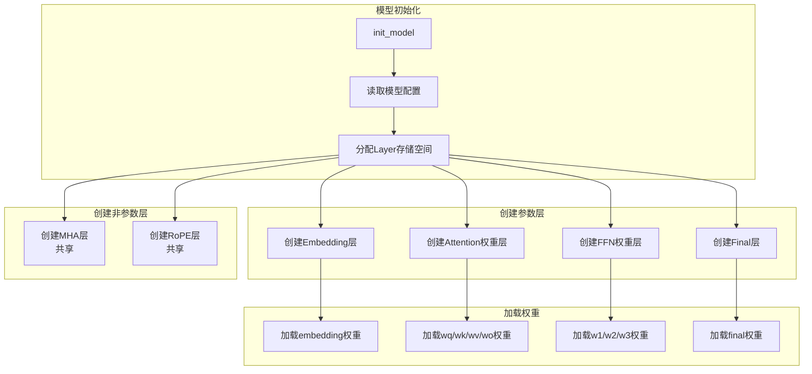

# KuiperLLama Layer层次结构图

## 1. Layer类型总览



## 2. LLaMA模型Layer组织结构

```mermaid
graph TD
    subgraph LLama2Model
        EMBED[embedding_layer_<br/>词嵌入层]

        subgraph 每层独立权重
            L0_WQ[wq_layers_[0]]
            L0_WK[wk_layers_[0]]
            L0_WV[wv_layers_[0]]
            L0_WO[wo_layers_[0]]
            L0_RMS_Q[rms_attn_layers_[0]]
            L0_RMS_F[rms_ffn_layers_[0]]
            L0_W1[w1_layers_[0]]
            L0_W2[w2_layers_[0]]
            L0_W3[w3_layers_[0]]

            L1_WQ[wq_layers_[1]]
            L1_WK[wk_layers_[1]]
            ...
        end

        subgraph 共享Layer
            MHA_SHARED[mha_layer_<br/>所有层共享]
            ROPE_SHARED[rope_layer_<br/>所有层共享]
        end

        FINAL_RMS[rms_final_layer_]
        FINAL_LINEAR[norm_linear_layer_]
    end

    EMBED --> L0_WQ
    L0_WQ --> MHA_SHARED
    MHA_SHARED --> L0_WO
    L0_WO --> L0_RMS_F
    L0_RMS_F --> L0_W1
    L0_W1 --> L0_W2
    L0_W3 --> L0_W2
    L0_W2 --> L1_WQ

    MHA_SHARED -.-> |layer_idx参数| L0_WQ
    MHA_SHARED -.-> |layer_idx参数| L1_WQ
```

## 3. Transformer Block内部结构

```mermaid
graph TD
    subgraph Input
        X[输入 x<br/>[batch, dim]]
    end

    subgraph "Attention Block (Pre-Norm)"
        NORM1[RMSNorm]
        QKV_PROJ[QKV Projection]

        subgraph QKV分支
            WQ[wq: x → Q<br/>[dim] → [head_num × head_size]]
            WK[wk: x → K<br/>[dim] → [kv_head_num × head_size]]
            WV[wv: x → V<br/>[dim] → [kv_head_num × head_size]]
        end

        ROPE[RoPE位置编码]
        KV_UPDATE[KV Cache更新]
        MHA_CALC[MHA计算]
        WO_PROJ[wo投影]
        RES1[残差连接: x + attn]
    end

    subgraph "FFN Block (Pre-Norm)"
        NORM2[RMSNorm]

        subgraph SwiGLU分支
            UP[w1: up projection<br/>[dim] → [hidden_dim]]
            GATE[w3: gate projection<br/>[dim] → [hidden_dim]]
            ACT[silu(up) × gate]
            DOWN[w2: down projection<br/>[hidden_dim] → [dim]]
        end

        RES2[残差连接: x + ffn]
    end

    subgraph Output
        OUT[输出<br/>[batch, dim]]
    end

    X --> NORM1
    NORM1 --> WQ
    NORM1 --> WK
    NORM1 --> WV
    WQ --> ROPE
    WK --> ROPE
    ROPE --> KV_UPDATE
    WV --> KV_UPDATE
    KV_UPDATE --> MHA_CALC
    MHA_CALC --> WO_PROJ
    WO_PROJ --> RES1
    X --> RES1

    RES1 --> NORM2
    NORM2 --> UP
    NORM2 --> GATE
    UP --> ACT
    GATE --> ACT
    ACT --> DOWN
    DOWN --> RES2
    RES1 --> RES2

    RES2 --> OUT
```

## 4. Layer参数矩阵维度



## 5. LayerForward调用顺序



## 6. 共享Layer vs 独立Layer

```mermaid
graph TB
    subgraph 每层独立的权重
        INDEP[每层有独立的权重矩阵]
        WQ_L0[wq_layers_[0]]
        WQ_L1[wq_layers_[1]]
        WQ_LN[wq_layers_[N-1]]
        WK_ALL[wk/wv/wo同理]
        W1_ALL[w1/w2/w3同理]
        RMS_ALL[rms同理]
    end

    subgraph 所有层共享的计算
        SHARED[所有层共享计算逻辑]
        MHA_ALL[mha_layer_<br/>通过set_layer_idx区分层]
        ROPE_ALL[rope_layer_<br/>通过pos参数区分]
    end

    subgraph 设计原因
        REASON1[权重不同: 每层学习不同特征]
        REASON2[计算相同: MHA/RoPE算法一致]
        REASON3[节省内存: 不重复存储相同逻辑]
    end

    INDEP --> WQ_L0
    INDEP --> WQ_L1
    INDEP --> WQ_LN

    SHARED --> MHA_ALL
    SHARED --> ROPE_ALL

    REASON1 --> INDEP
    REASON2 --> SHARED
    REASON3 --> SHARED
```

## 7. Layer初始化流程


