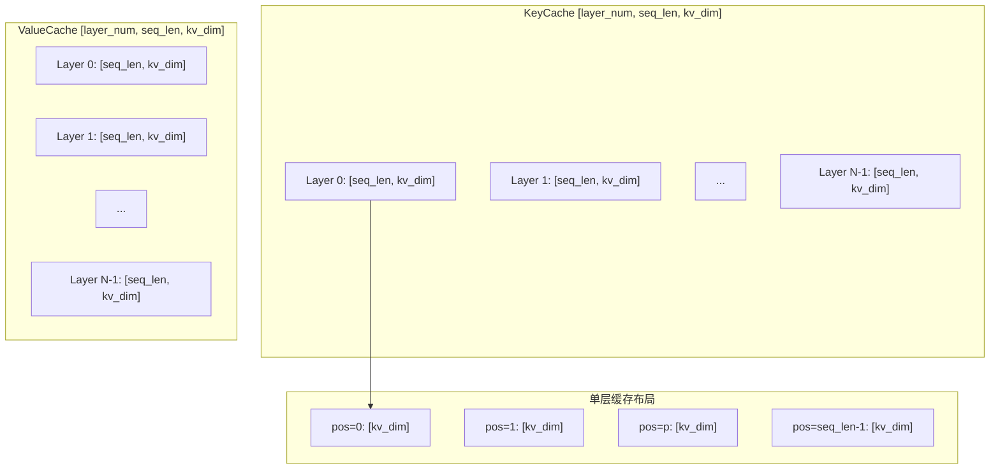
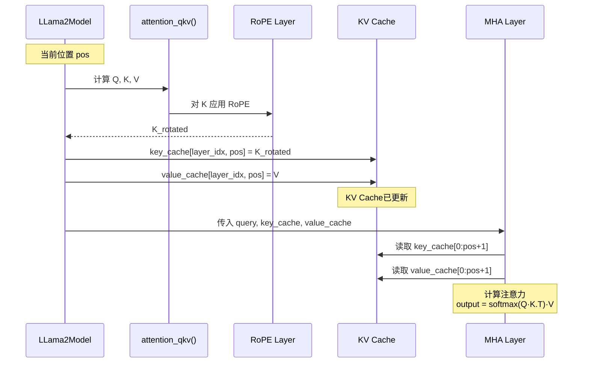
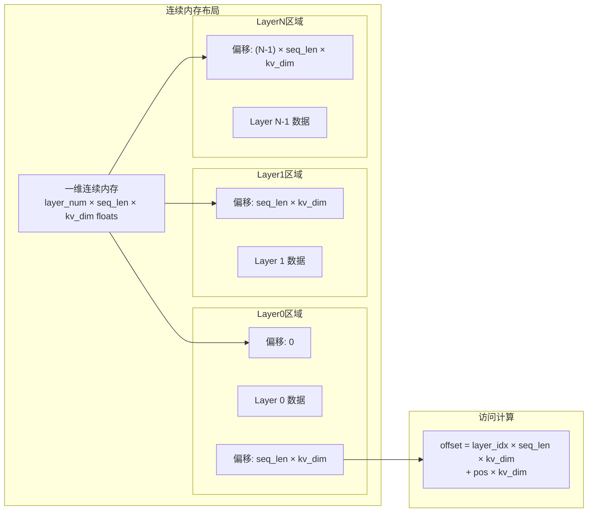
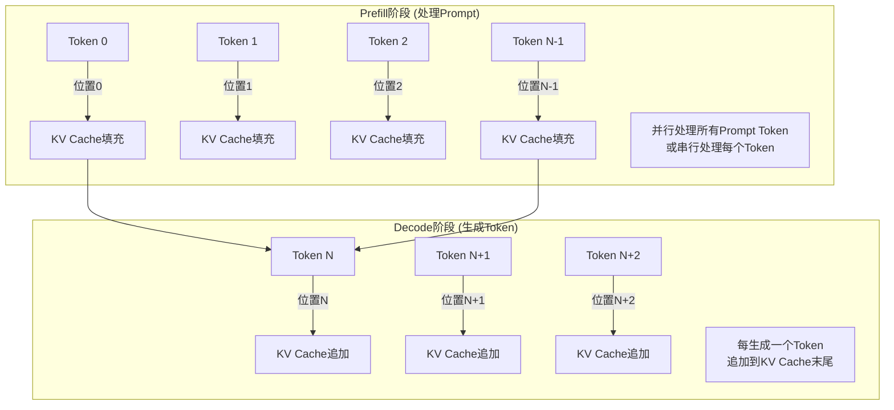
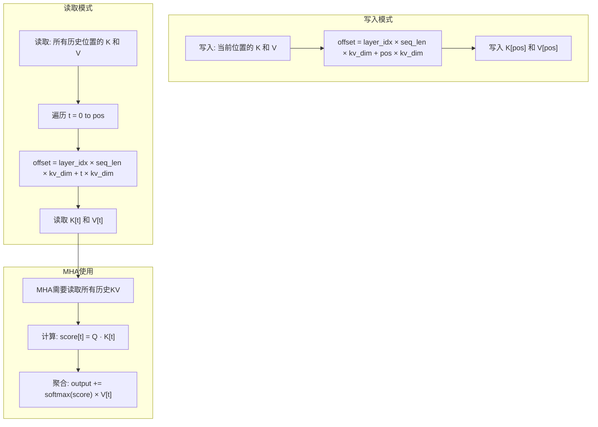
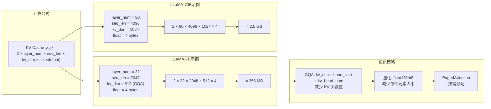
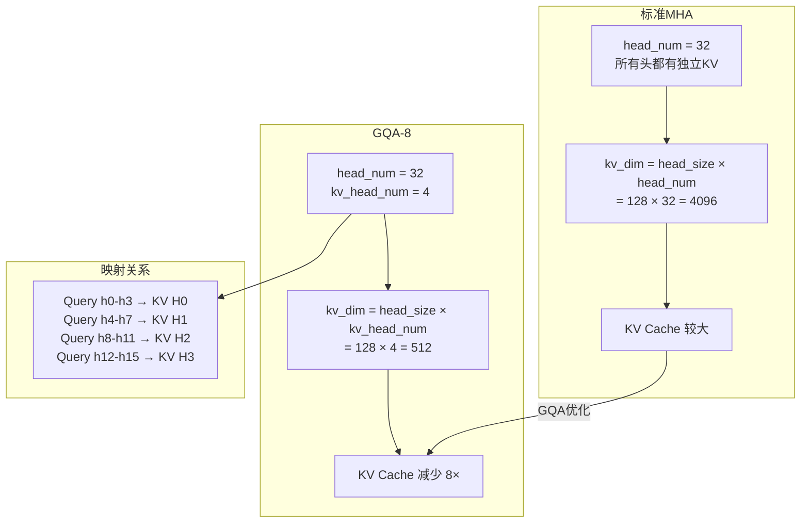
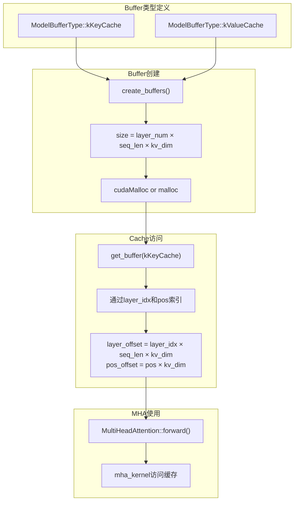
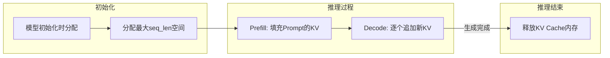

# KuiperLLama KV Cache管理图

## 1. KV Cache整体结构

## 2. KV Cache更新流程

## 3. KV Cache内存布局

## 4. Prefill vs Decode阶段

## 5. KV Cache访问模式

## 6. KV Cache显存计算

## 7. GQA对KV Cache的影响

## 8. KV Cache代码实现

## 9. KV Cache生命周期

