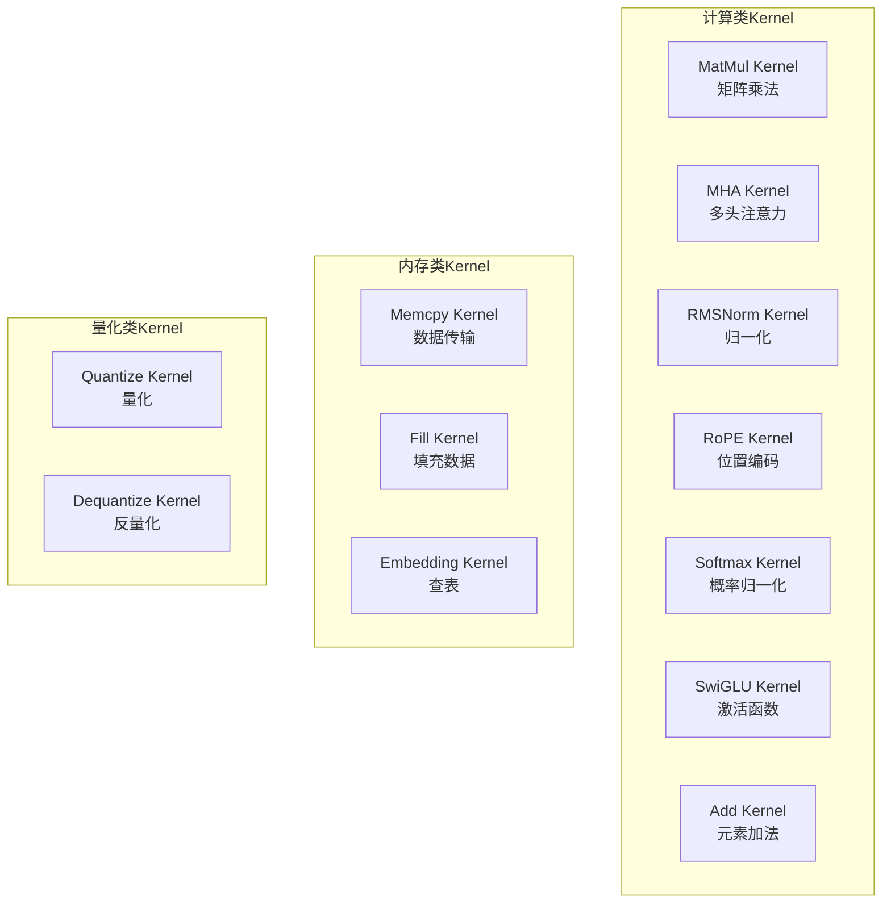
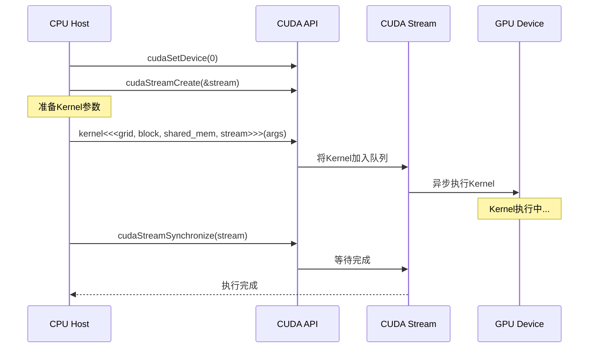
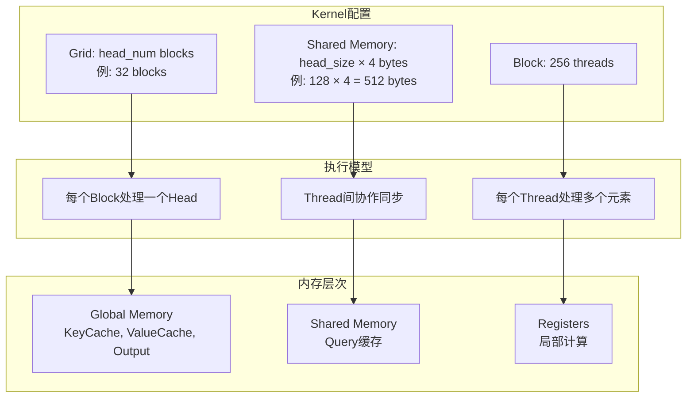
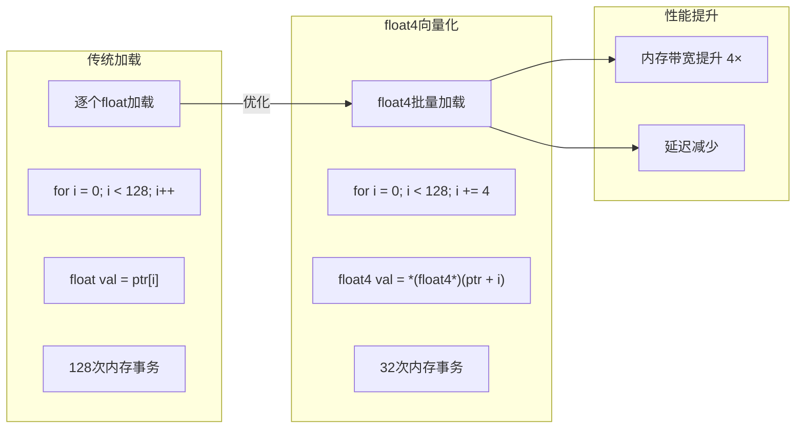
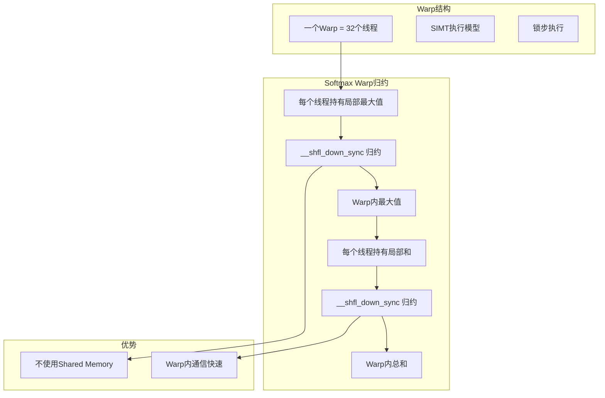
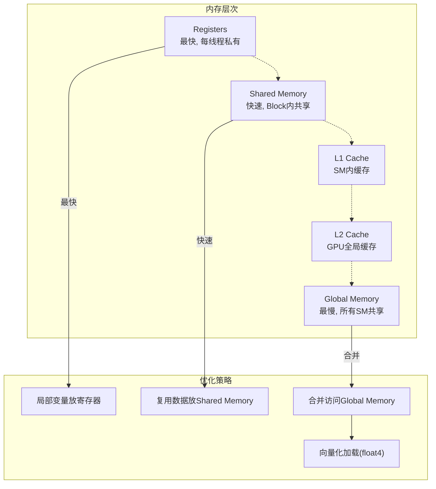
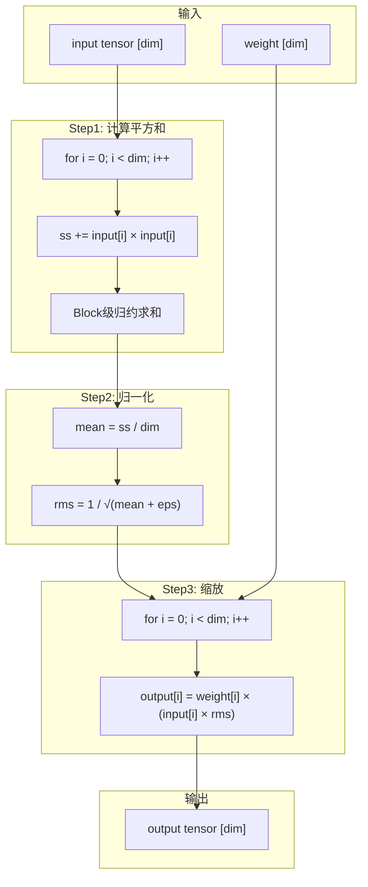
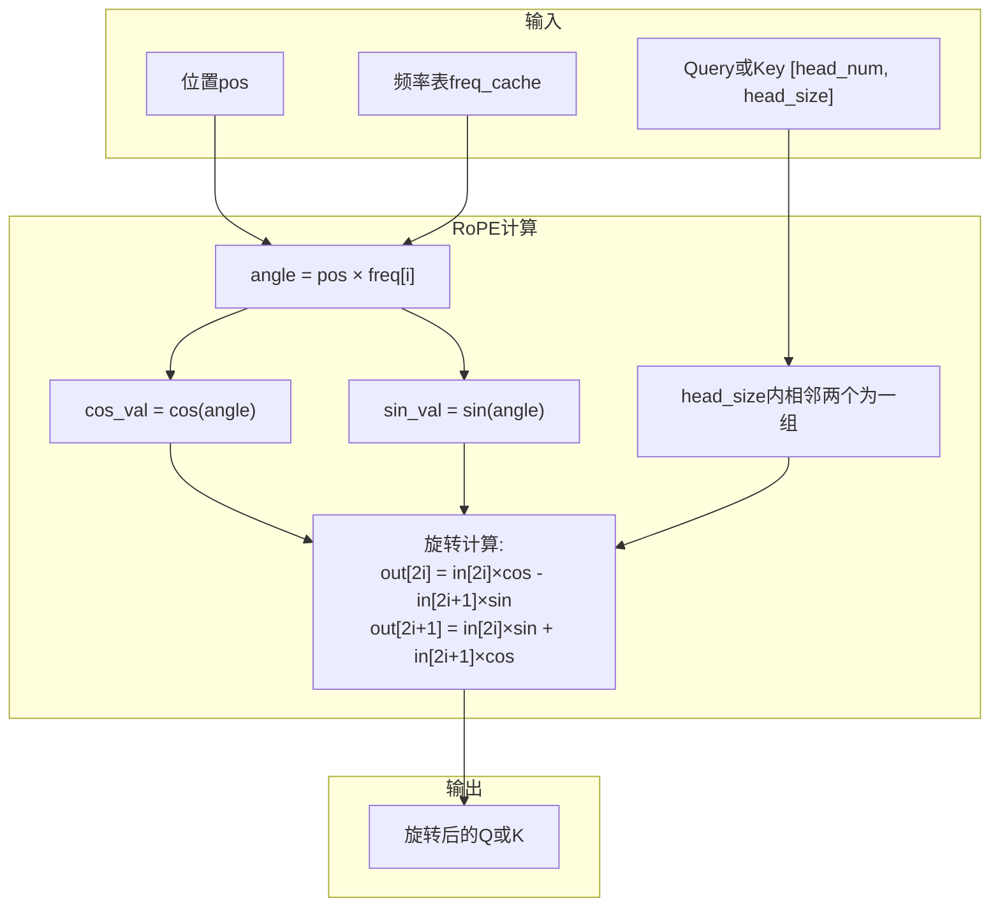
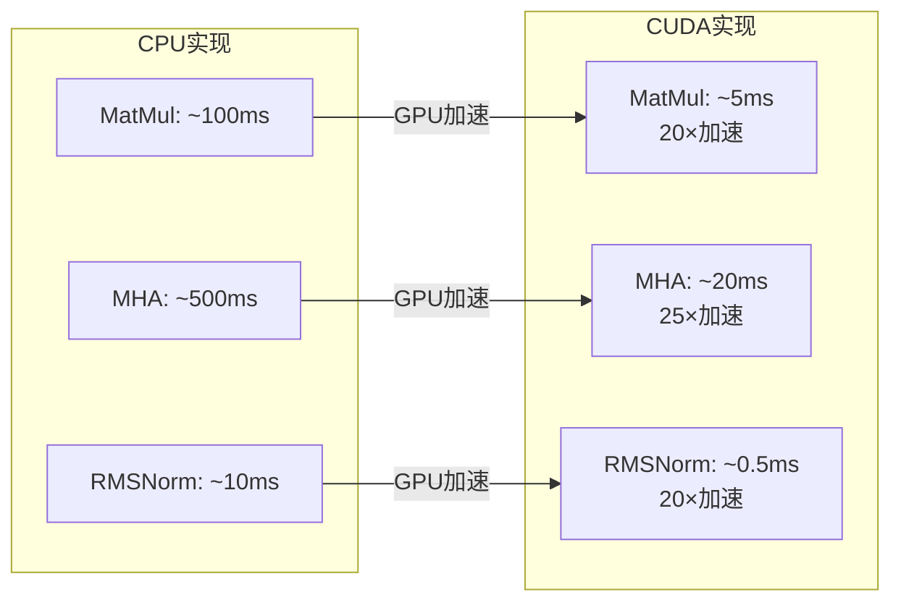

# KuiperLLama CUDA执行流程图

## 1. CUDA Kernel总览

## 2. CUDA Kernel调度流程

## 3. MHA CUDA Kernel详解

## 4. MHA Kernel执行步骤

```mermaid
graph TD
    subgraph Step1["Step 1: 加载Query到Shared Memory"]
        S1_START["每个线程加载一部分Query"]
        S1_LOOP["for i = threadIdx.x; i < head_size; i += blockDim.x"]
        S1_LOAD["s_query[i] = query[i]"]
        S1_SYNC["__syncthreads()"]
    end

    subgraph Step2["Step 2: 计算Attention Score"]
        S2_LOOP["for t = threadIdx.x; t <= pos; t += blockDim.x"]
        S2_LOAD_K["加载KeyCache[t] (float4向量化)"]
        S2_LOAD_Q["加载s_query (float4向量化)"]
        S2_DOT["点积计算: score += key × query"]
        S2_SCALE["score *= scale (1/√head_size)"]
        S2_STORE["score_head[t] = score"]
    end

    subgraph Step3["Step 3: Softmax"]
        S3_FIND_MAX["warp级归约找最大值"]
        S3_EXP["计算 exp(score - max)"]
        S3_SUM["warp级归约求和"]
        S3_NORM["score = exp / sum"]
    end

    subgraph Step4["Step 4: 加权求和Value"]
        S4_LOOP["for i = threadIdx.x; i < head_size; i += blockDim.x"]
        S4_ACC["value = 0"]
        S4_INNER["for t = 0; t <= pos; t++"]
        S4_LOAD_V["加载ValueCache[t][i]"]
        S4_MUL["value += score[t] × value_cache[t][i]"]
        S4_STORE["output[i] = value"]
    end

    S1_START --> S1_LOOP
    S1_LOOP --> S1_LOAD
    S1_LOAD --> S1_SYNC
    S1_SYNC --> S2_LOOP
    S2_LOOP --> S2_LOAD_K
    S2_LOAD_K --> S2_LOAD_Q
    S2_LOAD_Q --> S2_DOT
    S2_DOT --> S2_SCALE
    S2_SCALE --> S2_STORE
    S2_STORE --> S3_FIND_MAX
    S3_FIND_MAX --> S3_EXP
    S3_EXP --> S3_SUM
    S3_SUM --> S3_NORM
    S3_NORM --> S4_LOOP
    S4_LOOP --> S4_ACC
    S4_ACC --> S4_INNER
    S4_INNER --> S4_LOAD_V
    S4_LOAD_V --> S4_MUL
    S4_MUL --> S4_STORE
```

## 5. float4向量化优化

## 6. Warp级并行

## 7. CUDA内存层次优化

## 8. RMSNorm CUDA Kernel

## 9. RoPE CUDA Kernel

## 10. Kernel性能对比

