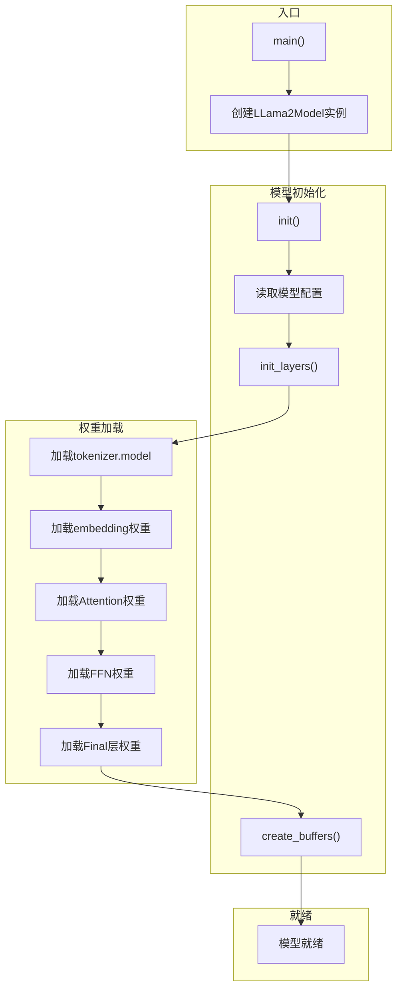
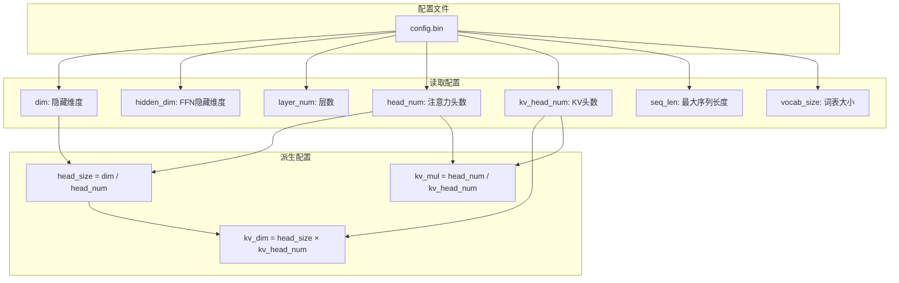
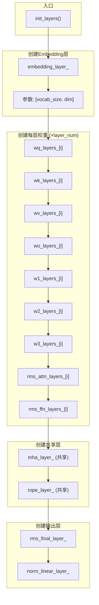
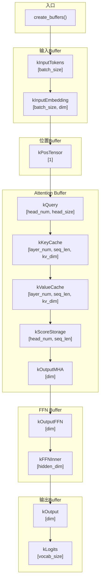
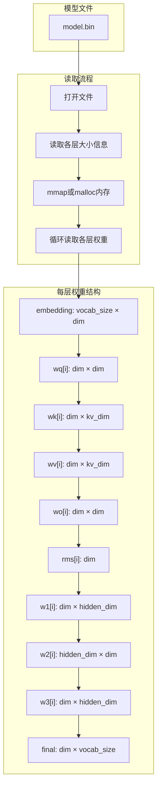
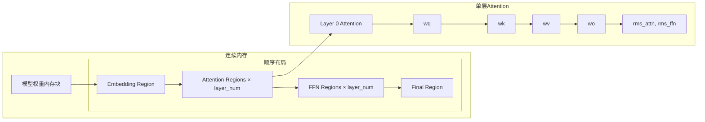
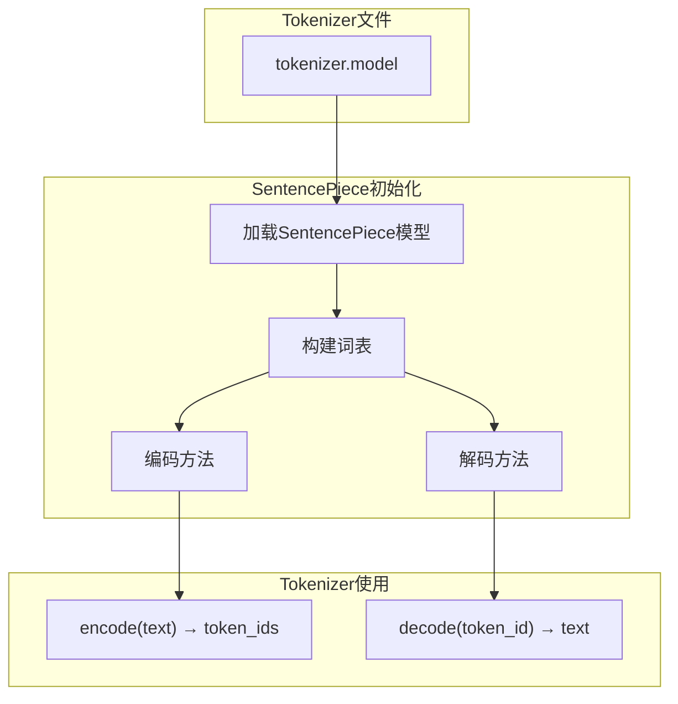
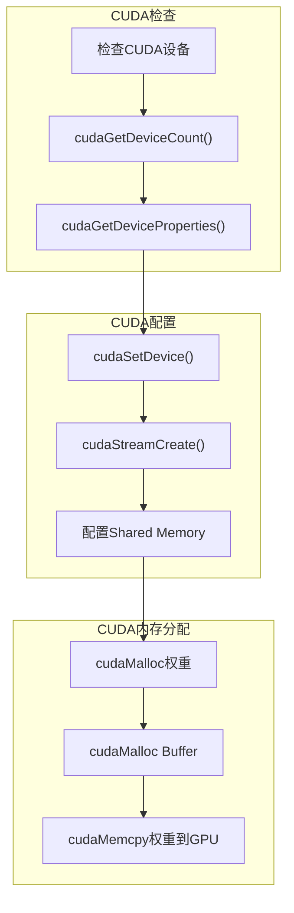
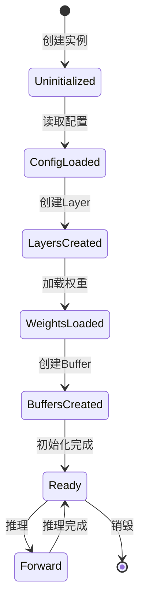
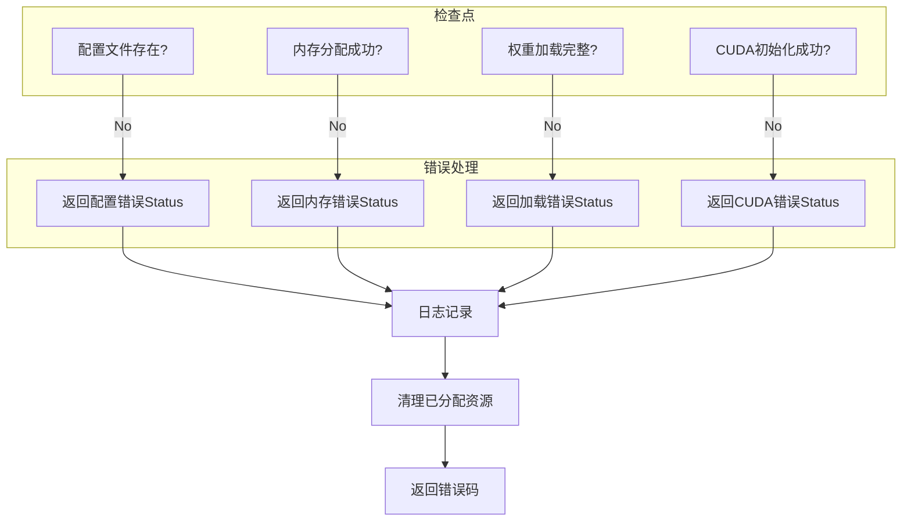

# KuiperLLama 模型初始化流程图

## 1. 模型初始化总览

```mermaid
graph TD
    subgraph 入口
        MAIN["main()"]
        CREATE["创建LLama2Model实例"]
    end

    subgraph 模型初始化
        INIT["init()"]
        READ_CONFIG["读取模型配置"]
        INIT_LAYERS["init_layers()"]
        CREATE_BUFS["create_buffers()"]
    end

    subgraph 权重加载
        LOAD_TOKENIZER["加载tokenizer.model"]
        LOAD_EMBEDDING["加载embedding权重"]
        LOAD_ATTN_W["加载Attention权重"]
        LOAD_FFN_W["加载FFN权重"]
        LOAD_FINAL["加载Final层权重"]
    end

    subgraph 就绪
        READY["模型就绪"]
    end

    MAIN --> CREATE
    CREATE --> INIT
    INIT --> READ_CONFIG
    READ_CONFIG --> INIT_LAYERS
    INIT_LAYERS --> LOAD_TOKENIZER
    LOAD_TOKENIZER --> LOAD_EMBEDDING
    LOAD_EMBEDDING --> LOAD_ATTN_W
    LOAD_ATTN_W --> LOAD_FFN_W
    LOAD_FFN_W --> LOAD_FINAL
    LOAD_FINAL --> CREATE_BUFS
    CREATE_BUFS --> READY
```

## 2. 配置加载流程

```mermaid
graph TD
    subgraph 配置文件
        CONFIG_FILE["config.bin"]
    end

    subgraph 读取配置
        READ_DIM["dim: 隐藏维度"]
        READ_HIDDEN["hidden_dim: FFN隐藏维度"]
        READ_LAYER["layer_num: 层数"]
        READ_HEAD["head_num: 注意力头数"]
        READ_KV_HEAD["kv_head_num: KV头数"]
        READ_SEQ["seq_len: 最大序列长度"]
        READ_VOCAB["vocab_size: 词表大小"]
    end

    subgraph 派生配置
        HEAD_SIZE["head_size = dim / head_num"]
        KV_DIM["kv_dim = head_size × kv_head_num"]
        KV_MUL["kv_mul = head_num / kv_head_num"]
    end

    CONFIG_FILE --> READ_DIM
    CONFIG_FILE --> READ_HIDDEN
    CONFIG_FILE --> READ_LAYER
    CONFIG_FILE --> READ_HEAD
    CONFIG_FILE --> READ_KV_HEAD
    CONFIG_FILE --> READ_SEQ
    CONFIG_FILE --> READ_VOCAB

    READ_DIM --> HEAD_SIZE
    READ_HEAD --> HEAD_SIZE
    READ_HEAD --> KV_MUL
    READ_KV_HEAD --> KV_DIM
    READ_KV_HEAD --> KV_MUL
    HEAD_SIZE --> KV_DIM
```

## 3. Layer创建流程

```mermaid
graph TD
    subgraph 入口
        INIT_LAYERS["init_layers()"]
    end

    subgraph 创建Embedding层
        EMB_LAYER["embedding_layer_"]
        EMB_PARAM["参数: [vocab_size, dim]"]
    end

    subgraph 创建每层权重 ["创建每层权重 (×layer_num)"]
        WQ_LAY["wq_layers_[i]"]
        WK_LAY["wk_layers_[i]"]
        WV_LAY["wv_layers_[i]"]
        WO_LAY["wo_layers_[i]"]

        W1_LAY["w1_layers_[i]"]
        W2_LAY["w2_layers_[i]"]
        W3_LAY["w3_layers_[i]"]

        RMS_ATTN["rms_attn_layers_[i]"]
        RMS_FFN["rms_ffn_layers_[i]"]
    end

    subgraph 创建共享层
        MHA_LAY["mha_layer_ (共享)"]
        ROPE_LAY["rope_layer_ (共享)"]
    end

    subgraph 创建输出层
        RMS_FINAL["rms_final_layer_"]
        FINAL_LIN["norm_linear_layer_"]
    end

    INIT_LAYERS --> EMB_LAYER
    EMB_LAYER --> EMB_PARAM
    EMB_PARAM --> WQ_LAY
    WQ_LAY --> WK_LAY
    WK_LAY --> WV_LAY
    WV_LAY --> WO_LAY
    WO_LAY --> W1_LAY
    W1_LAY --> W2_LAY
    W2_LAY --> W3_LAY
    W3_LAY --> RMS_ATTN
    RMS_ATTN --> RMS_FFN
    RMS_FFN --> MHA_LAY
    MHA_LAY --> ROPE_LAY
    ROPE_LAY --> RMS_FINAL
    RMS_FINAL --> FINAL_LIN
```

## 4. Buffer创建流程

```mermaid
graph TD
    subgraph 入口
        CREATE_BUFS["create_buffers()"]
    end

    subgraph 输入Buffer
        INPUT_BUF["kInputTokens<br/>[batch_size]"]
        EMB_BUF["kInputEmbedding<br/>[batch_size, dim]"]
    end

    subgraph 位置Buffer
        POS_BUF["kPosTensor<br/>[1]"]
    end

    subgraph Attention Buffer
        QUERY_BUF["kQuery<br/>[head_num, head_size]"]
        KEY_BUF["kKeyCache<br/>[layer_num, seq_len, kv_dim]"]
        VALUE_BUF["kValueCache<br/>[layer_num, seq_len, kv_dim]"]
        SCORE_BUF["kScoreStorage<br/>[head_num, seq_len]"]
        MHA_OUT_BUF["kOutputMHA<br/>[dim]"]
    end

    subgraph FFN Buffer
        FFN_BUF["kOutputFFN<br/>[dim]"]
        FFN_IN_BUF["kFFNInner<br/>[hidden_dim]"]
    end

    subgraph 输出Buffer
        OUT_BUF["kOutput<br/>[dim]"]
        LOGITS_BUF["kLogits<br/>[vocab_size]"]
    end

    CREATE_BUFS --> INPUT_BUF
    INPUT_BUF --> EMB_BUF
    EMB_BUF --> POS_BUF
    POS_BUF --> QUERY_BUF
    QUERY_BUF --> KEY_BUF
    KEY_BUF --> VALUE_BUF
    VALUE_BUF --> SCORE_BUF
    SCORE_BUF --> MHA_OUT_BUF
    MHA_OUT_BUF --> FFN_BUF
    FFN_BUF --> FFN_IN_BUF
    FFN_IN_BUF --> OUT_BUF
    OUT_BUF --> LOGITS_BUF
```

## 5. 权重加载流程

```mermaid
graph TD
    subgraph 模型文件
        MODEL_BIN["model.bin"]
    end

    subgraph 读取流程
        OPEN["打开文件"]
        READ_SIZE["读取各层大小信息"]
        MMAP["mmap或malloc内存"]
        LOAD_LOOP["循环读取各层权重"]
    end

    subgraph 每层权重结构
        EMB_W["embedding: vocab_size × dim"]
        WQ_W["wq[i]: dim × dim"]
        WK_W["wk[i]: dim × kv_dim"]
        WV_W["wv[i]: dim × kv_dim"]
        WO_W["wo[i]: dim × dim"]
        RMS_W["rms[i]: dim"]
        W1_W["w1[i]: dim × hidden_dim"]
        W2_W["w2[i]: hidden_dim × dim"]
        W3_W["w3[i]: dim × hidden_dim"]
        FINAL_W["final: dim × vocab_size"]
    end

    MODEL_BIN --> OPEN
    OPEN --> READ_SIZE
    READ_SIZE --> MMAP
    MMAP --> LOAD_LOOP
    LOAD_LOOP --> EMB_W
    EMB_W --> WQ_W
    WQ_W --> WK_W
    WK_W --> WV_W
    WV_W --> WO_W
    WO_W --> RMS_W
    RMS_W --> W1_W
    W1_W --> W2_W
    W2_W --> W3_W
    W3_W --> FINAL_W
```

## 6. 权重内存布局

```mermaid
graph LR
    subgraph 连续内存
        MEM["模型权重内存块"]

        subgraph 顺序布局
            EMB_REGION["Embedding Region"]
            ATTN_REGION["Attention Regions × layer_num"]
            FFN_REGION["FFN Regions × layer_num"]
            FINAL_REGION["Final Region"]
        end
    end

    subgraph 单层Attention
        ATTN_L0["Layer 0 Attention"]
        WQ0["wq"]
        WK0["wk"]
        WV0["wv"]
        WO0["wo"]
        RMS0["rms_attn, rms_ffn"]
    end

    MEM --> EMB_REGION
    EMB_REGION --> ATTN_REGION
    ATTN_REGION --> ATTN_L0
    ATTN_L0 --> WQ0
    WQ0 --> WK0
    WK0 --> WV0
    WV0 --> WO0
    WO0 --> RMS0
    ATTN_REGION --> FFN_REGION
    FFN_REGION --> FINAL_REGION
```

## 7. Tokenizer初始化

```mermaid
graph TD
    subgraph Tokenizer文件
        TOKENIZER_FILE["tokenizer.model"]
    end

    subgraph SentencePiece初始化
        SP_LOAD["加载SentencePiece模型"]
        SP_VOCAB["构建词表"]
        SP_ENCODE["编码方法"]
        SP_DECODE["解码方法"]
    end

    subgraph Tokenizer使用
        ENCODE["encode(text) → token_ids"]
        DECODE["decode(token_id) → text"]
    end

    TOKENIZER_FILE --> SP_LOAD
    SP_LOAD --> SP_VOCAB
    SP_VOCAB --> SP_ENCODE
    SP_VOCAB --> SP_DECODE

    SP_ENCODE --> ENCODE
    SP_DECODE --> DECODE
```

## 8. CUDA初始化流程

```mermaid
graph TD
    subgraph CUDA检查
        CHECK["检查CUDA设备"]
        COUNT["cudaGetDeviceCount()"]
        PROP["cudaGetDeviceProperties()"]
    end

    subgraph CUDA配置
        SET_DEV["cudaSetDevice()"]
        CREATE_STREAM["cudaStreamCreate()"]
        CONFIG_SM["配置Shared Memory"]
    end

    subgraph CUDA内存分配
        ALLOC_WEIGHT["cudaMalloc权重"]
        ALLOC_BUF["cudaMalloc Buffer"]
        COPY_WEIGHT["cudaMemcpy权重到GPU"]
    end

    CHECK --> COUNT
    COUNT --> PROP
    PROP --> SET_DEV
    SET_DEV --> CREATE_STREAM
    CREATE_STREAM --> CONFIG_SM
    CONFIG_SM --> ALLOC_WEIGHT
    ALLOC_WEIGHT --> ALLOC_BUF
    ALLOC_BUF --> COPY_WEIGHT
```

## 9. 模型状态转换

```mermaid
stateDiagram-v2
    [*] --> Uninitialized: 创建实例
    Uninitialized --> ConfigLoaded: 读取配置
    ConfigLoaded --> LayersCreated: 创建Layer
    LayersCreated --> WeightsLoaded: 加载权重
    WeightsLoaded --> BuffersCreated: 创建Buffer
    BuffersCreated --> Ready: 初始化完成

    Ready --> Forward: 推理
    Forward --> Ready: 推理完成

    Ready --> [*]: 销毁
```

## 10. 初始化错误处理

```mermaid
graph TD
    subgraph 检查点
        C1["配置文件存在?"]
        C2["内存分配成功?"]
        C3["权重加载完整?"]
        C4["CUDA初始化成功?"]
    end

    subgraph 错误处理
        E1["返回配置错误Status"]
        E2["返回内存错误Status"]
        E3["返回加载错误Status"]
        E4["返回CUDA错误Status"]
    end

    C1 --> |No| E1
    C2 --> |No| E2
    C3 --> |No| E3
    C4 --> |No| E4

    E1 --> LOG["日志记录"]
    E2 --> LOG
    E3 --> LOG
    E4 --> LOG

    LOG --> CLEANUP["清理已分配资源"]
    CLEANUP --> RETURN["返回错误码"]
```
