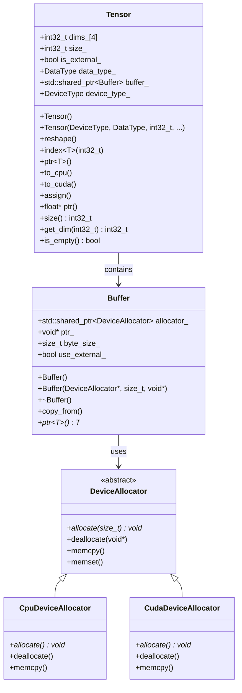
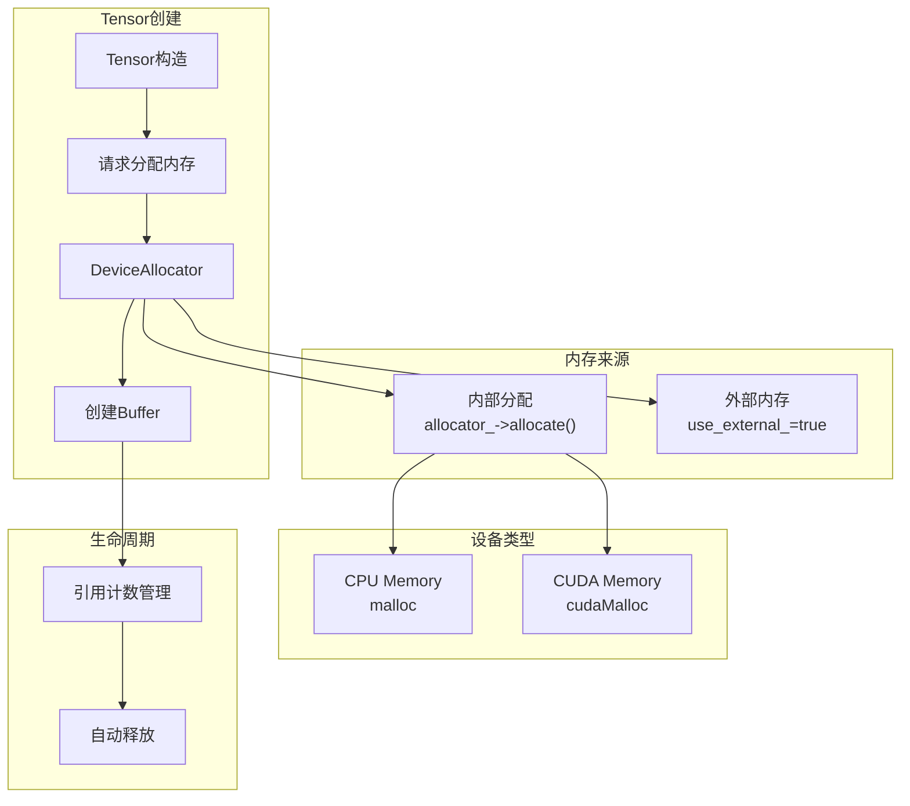
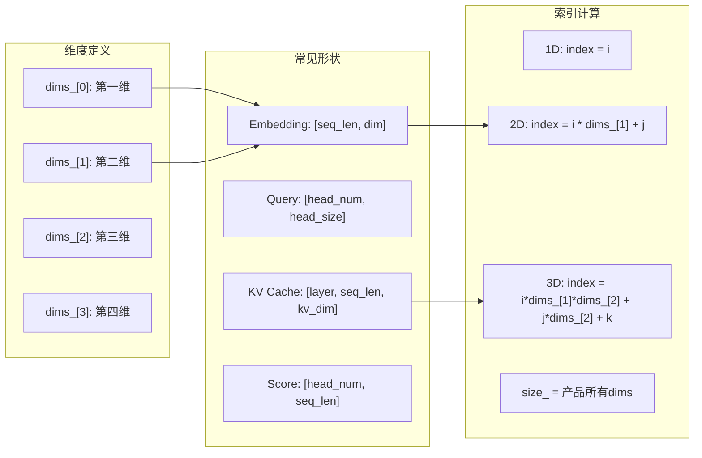
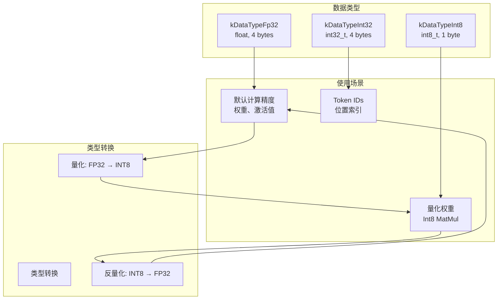
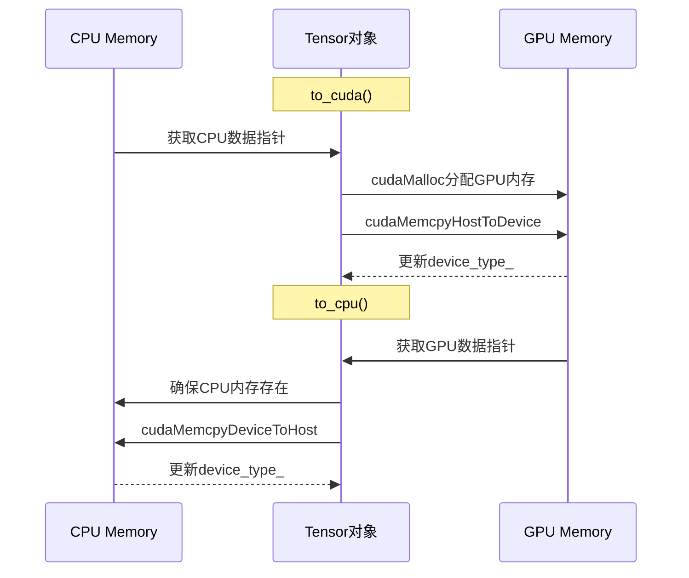
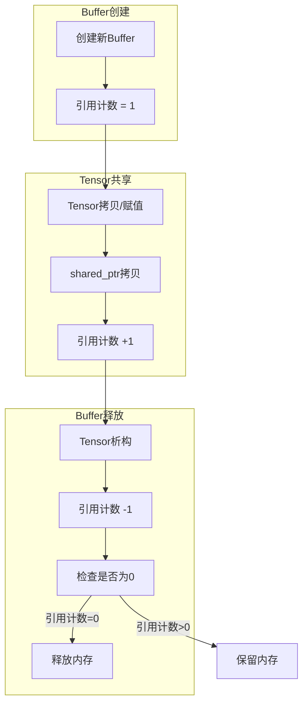
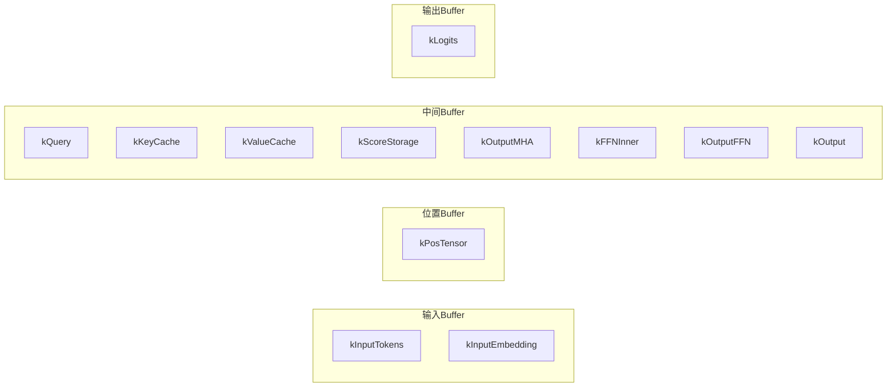
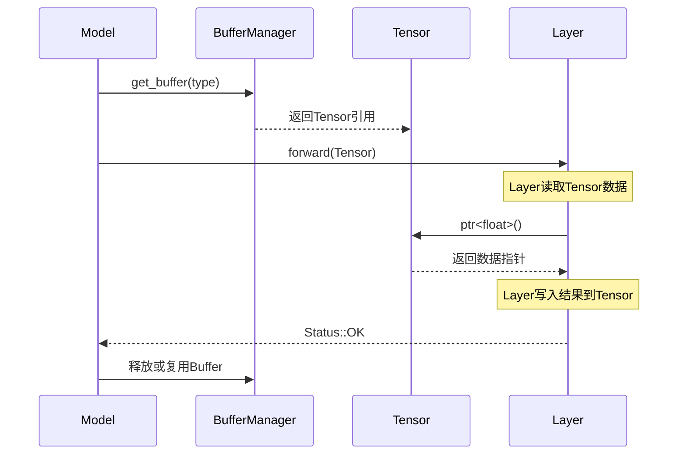
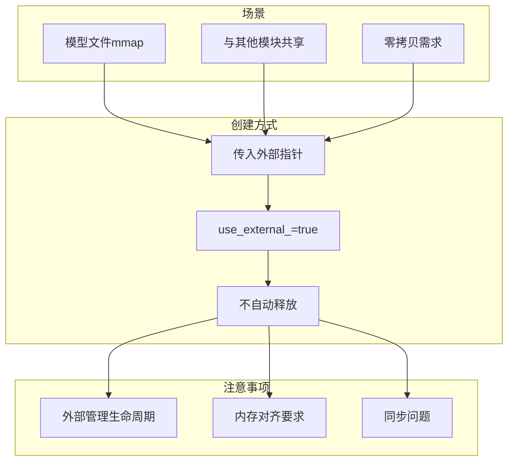
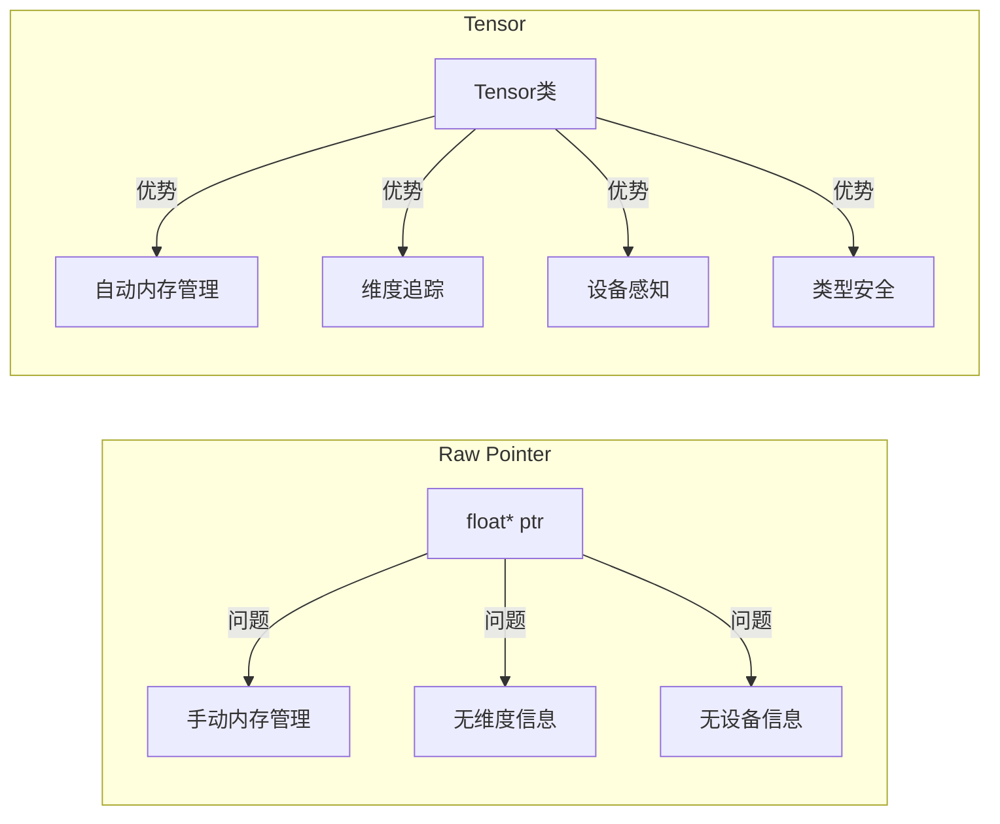

# KuiperLLama Tensor系统图

## 1. Tensor类结构

## 2. Tensor内存管理

## 3. Tensor维度操作

## 4. Tensor数据类型

## 5. Tensor设备转移

## 6. Buffer引用计数

## 7. ModelBufferType枚举

## 8. Tensor在推理中的使用

## 9. 外部内存Tensor

## 10. Tensor vs raw pointer

