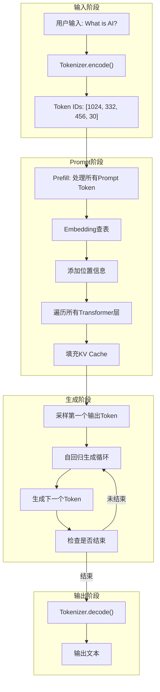
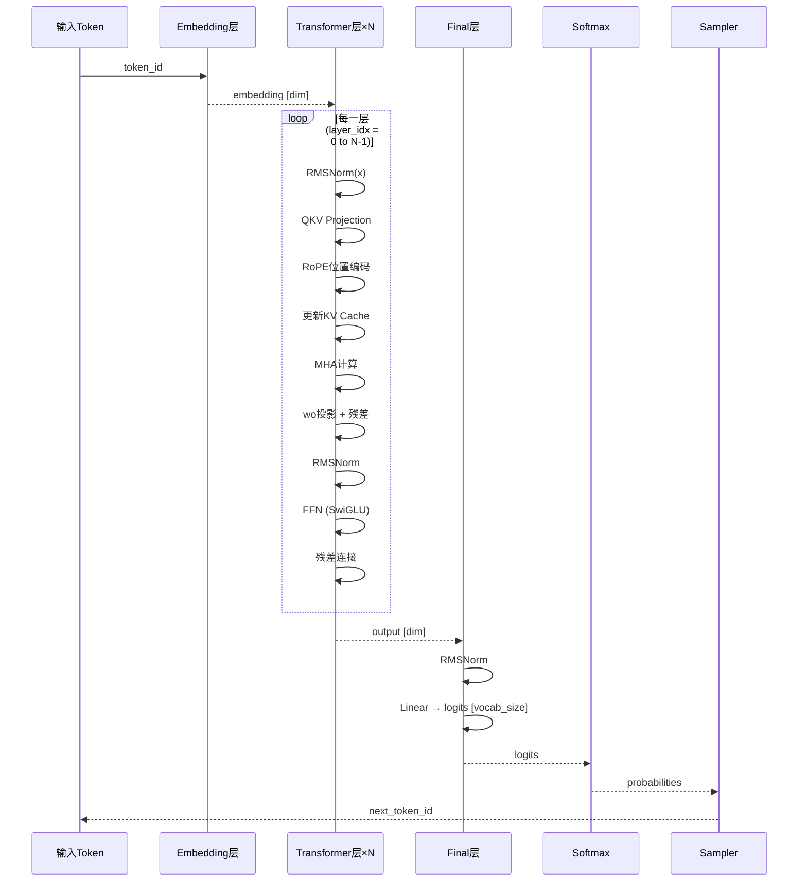
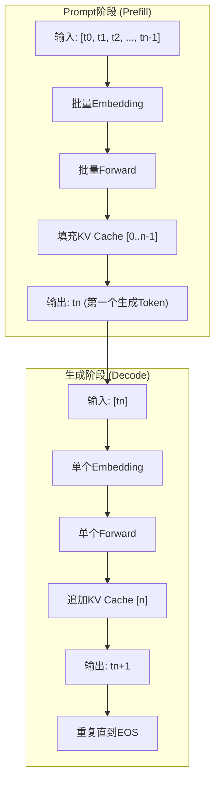
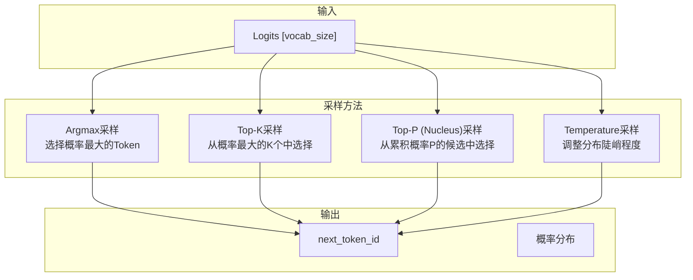
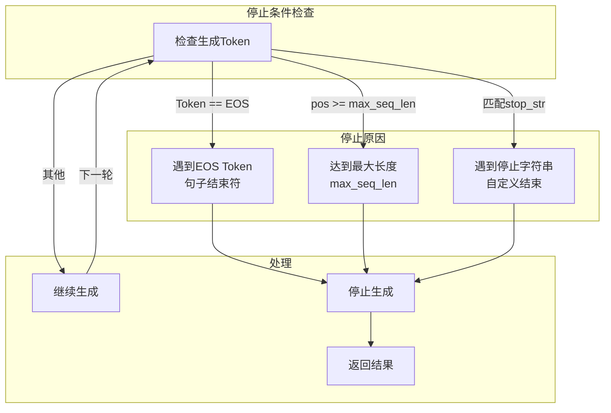
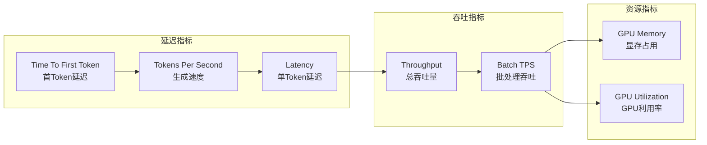
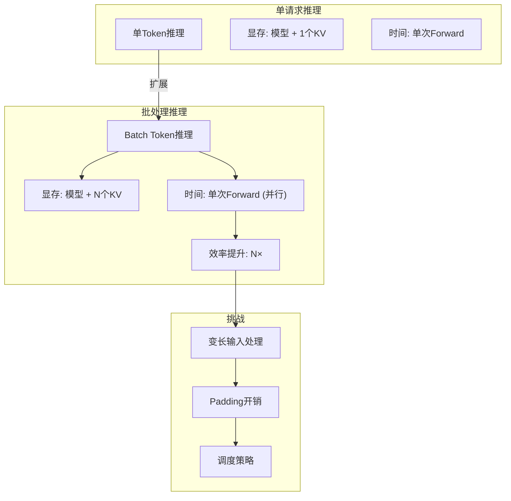
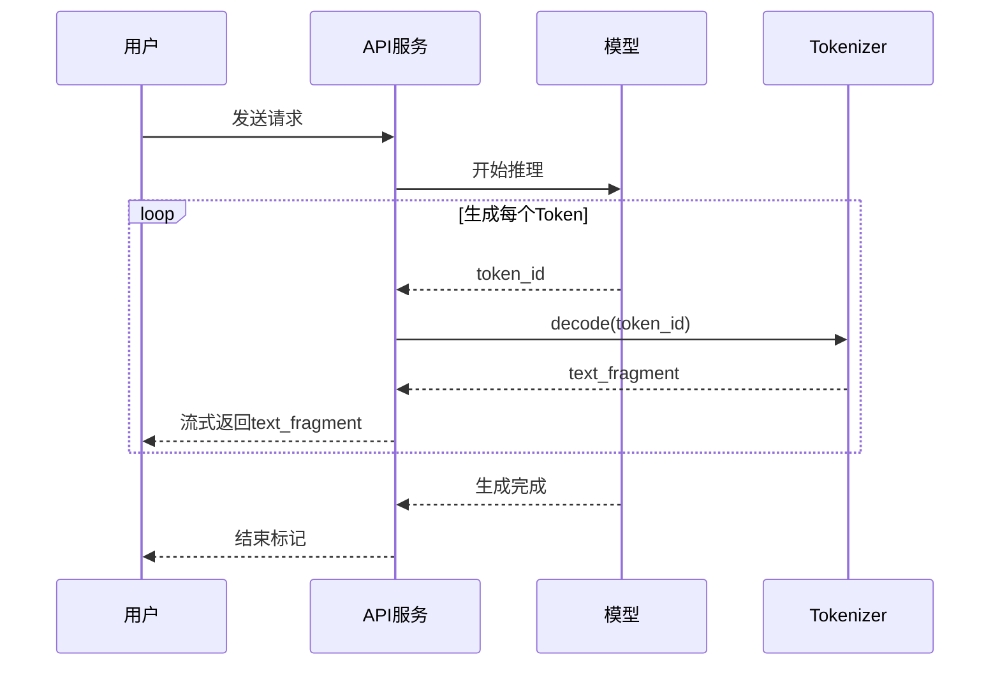
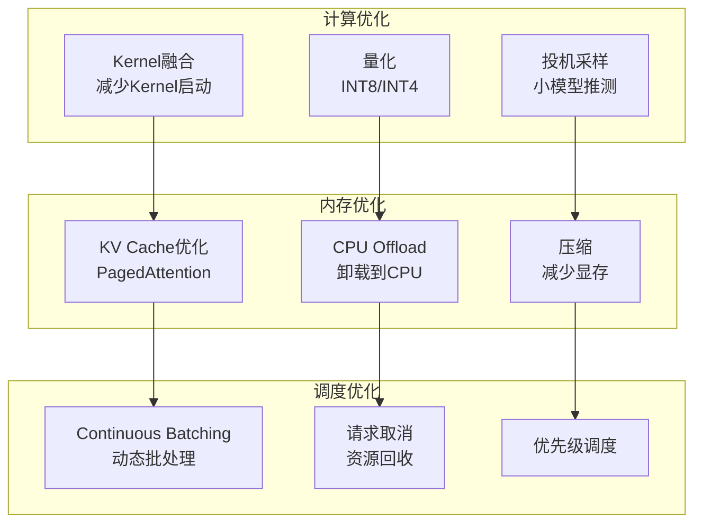
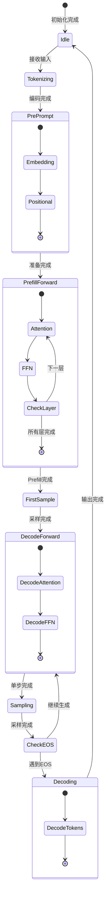

# KuiperLLama 推理生成流程图

## 1. 完整推理流程

```mermaid
graph TD
    subgraph 输入阶段
        INPUT["用户输入: What is AI?"]
        TOKENIZE["Tokenizer.encode()"]
        TOKENS["Token IDs: [1024, 332, 456, 30]"]
    end

    subgraph Prompt阶段
        PREFILL["Prefill: 处理所有Prompt Token"]
        EMBED["Embedding查表"]
        POS_EMB["添加位置信息"]
        LAYER_LOOP["遍历所有Transformer层"]
        FILL_KV["填充KV Cache"]
    end

    subgraph 生成阶段
        SAMPLE_FIRST["采样第一个输出Token"]
        GEN_LOOP["自回归生成循环"]
        NEXT_TOKEN["生成下一个Token"]
        STOP_CHECK["检查是否结束"]
    end

    subgraph 输出阶段
        DECODE["Tokenizer.decode()"]
        OUTPUT["输出文本"]
    end

    INPUT --> TOKENIZE
    TOKENIZE --> TOKENS
    TOKENS --> PREFILL
    PREFILL --> EMBED
    EMBED --> POS_EMB
    POS_EMB --> LAYER_LOOP
    LAYER_LOOP --> FILL_KV
    FILL_KV --> SAMPLE_FIRST
    SAMPLE_FIRST --> GEN_LOOP
    GEN_LOOP --> NEXT_TOKEN
    NEXT_TOKEN --> STOP_CHECK
    STOP_CHECK --> |未结束| GEN_LOOP
    STOP_CHECK --> |结束| DECODE
    DECODE --> OUTPUT
```

## 2. 单Token推理流程

```mermaid
sequenceDiagram
    participant Input as 输入Token
    participant Embed as Embedding层
    participant Layers as Transformer层×N
    participant Final as Final层
    participant Softmax as Softmax
    participant Sample as Sampler

    Input->>Embed: token_id
    Embed-->>Layers: embedding [dim]

    loop 每一层 (layer_idx = 0 to N-1)
        Layers->>Layers: RMSNorm(x)
        Layers->>Layers: QKV Projection
        Layers->>Layers: RoPE位置编码
        Layers->>Layers: 更新KV Cache
        Layers->>Layers: MHA计算
        Layers->>Layers: wo投影 + 残差
        Layers->>Layers: RMSNorm
        Layers->>Layers: FFN (SwiGLU)
        Layers->>Layers: 残差连接
    end

    Layers-->>Final: output [dim]
    Final->>Final: RMSNorm
    Final->>Final: Linear → logits [vocab_size]
    Final-->>Softmax: logits
    Softmax-->>Sample: probabilities
    Sample-->>Input: next_token_id
```

## 3. Prompt处理 vs Token生成

```mermaid
graph TB
    subgraph Prompt阶段["Prompt阶段 (Prefill)"]
        P_INPUT["输入: [t0, t1, t2, ..., tn-1]"]
        P_EMBED["批量Embedding"]
        P_FORWARD["批量Forward"]
        P_KV["填充KV Cache [0..n-1]"]
        P_OUT["输出: tn (第一个生成Token)"]
    end

    subgraph 生成阶段["生成阶段 (Decode)"]
        D_INPUT["输入: [tn]"]
        D_EMBED["单个Embedding"]
        D_FORWARD["单个Forward"]
        D_KV["追加KV Cache [n]"]
        D_OUT["输出: tn+1"]

        D_REPEAT["重复直到EOS"]
    end

    P_INPUT --> P_EMBED
    P_EMBED --> P_FORWARD
    P_FORWARD --> P_KV
    P_KV --> P_OUT

    P_OUT --> D_INPUT
    D_INPUT --> D_EMBED
    D_EMBED --> D_FORWARD
    D_FORWARD --> D_KV
    D_KV --> D_OUT
    D_OUT --> D_REPEAT
```

## 4. 采样策略

```mermaid
graph TB
    subgraph 输入
        LOGITS["Logits [vocab_size]"]
    end

    subgraph 采样方法
        ARGMAX["Argmax采样<br/>选择概率最大的Token"]
        TOP_K["Top-K采样<br/>从概率最大的K个中选择"]
        TOP_P["Top-P (Nucleus)采样<br/>从累积概率P的候选中选择"]
        TEMP["Temperature采样<br/>调整分布陡峭程度"]
    end

    subgraph 输出
        TOKEN["next_token_id"]
        PROB["概率分布"]
    end

    LOGITS --> ARGMAX
    LOGITS --> TOP_K
    LOGITS --> TOP_P
    LOGITS --> TEMP

    ARGMAX --> TOKEN
    TOP_K --> TOKEN
    TOP_P --> TOKEN
    TEMP --> TOKEN
```

## 5. 生成停止条件

```mermaid
graph TD
    subgraph 停止条件检查
        CHECK["检查生成Token"]
    end

    subgraph 停止原因
        EOS["遇到EOS Token<br/>句子结束符"]
        MAX_LEN["达到最大长度<br/>max_seq_len"]
        STOP_STR["遇到停止字符串<br/>自定义结束"]
    end

    subgraph 处理
        CONTINUE["继续生成"]
        STOP["停止生成"]
        RETURN["返回结果"]
    end

    CHECK --> |Token == EOS| EOS
    CHECK --> |pos >= max_seq_len| MAX_LEN
    CHECK --> |匹配stop_str| STOP_STR
    CHECK --> |其他| CONTINUE

    EOS --> STOP
    MAX_LEN --> STOP
    STOP_STR --> STOP
    CONTINUE --> |下一轮| CHECK

    STOP --> RETURN
```

## 6. 推理性能指标

```mermaid
graph LR
    subgraph 延迟指标
        TTFT["Time To First Token<br/>首Token延迟"]
        TPS["Tokens Per Second<br/>生成速度"]
        LATENCY["Latency<br/>单Token延迟"]
    end

    subgraph 吞吐指标
        THROUGHPUT["Throughput<br/>总吞吐量"]
        BATCH_TPS["Batch TPS<br/>批处理吞吐"]
    end

    subgraph 资源指标
        GPU_MEM["GPU Memory<br/>显存占用"]
        GPU_UTIL["GPU Utilization<br/>GPU利用率"]
    end

    TTFT --> TPS
    TPS --> LATENCY
    LATENCY --> THROUGHPUT
    THROUGHPUT --> BATCH_TPS

    BATCH_TPS --> GPU_MEM
    BATCH_TPS --> GPU_UTIL
```

## 7. 批处理推理

```mermaid
graph TB
    subgraph 单请求推理
        SINGLE["单Token推理"]
        SINGLE_MEM["显存: 模型 + 1个KV"]
        SINGLE_TIME["时间: 单次Forward"]
    end

    subgraph 批处理推理
        BATCH["Batch Token推理"]
        BATCH_MEM["显存: 模型 + N个KV"]
        BATCH_TIME["时间: 单次Forward (并行)"]
        BATCH_EFF["效率提升: N×"]
    end

    subgraph 挑战
        VAR_LEN["变长输入处理"]
        PAD["Padding开销"]
        SCHED["调度策略"]
    end

    SINGLE --> |扩展| BATCH
    BATCH --> BATCH_MEM
    BATCH --> BATCH_TIME
    BATCH_TIME --> BATCH_EFF

    BATCH_EFF --> VAR_LEN
    VAR_LEN --> PAD
    PAD --> SCHED
```

## 8. 流式输出

```mermaid
sequenceDiagram
    participant User as 用户
    participant API as API服务
    participant Model as 模型
    participant Tokenizer as Tokenizer

    User->>API: 发送请求
    API->>Model: 开始推理

    loop 生成每个Token
        Model-->>API: token_id
        API->>Tokenizer: decode(token_id)
        Tokenizer-->>API: text_fragment
        API-->>User: 流式返回text_fragment
    end

    Model-->>API: 生成完成
    API-->>User: 结束标记
```

## 9. 推理优化策略

```mermaid
graph TB
    subgraph 计算优化
        KERNEL_FUSE["Kernel融合<br/>减少Kernel启动"]
        QUANT["量化<br/>INT8/INT4"]
        SPEC["投机采样<br/>小模型推测"]
    end

    subgraph 内存优化
        KV_OPT["KV Cache优化<br/>PagedAttention"]
        OFFLOAD["CPU Offload<br/>卸载到CPU"]
        COMPRESS["压缩<br/>减少显存"]
    end

    subgraph 调度优化
        CONT_BATCH["Continuous Batching<br/>动态批处理"]
        CANCEL["请求取消<br/>资源回收"]
        PRIOR["优先级调度"]
    end

    KERNEL_FUSE --> KV_OPT
    QUANT --> OFFLOAD
    SPEC --> COMPRESS

    KV_OPT --> CONT_BATCH
    OFFLOAD --> CANCEL
    COMPRESS --> PRIOR
```

## 10. 推理流程状态机

```mermaid
stateDiagram-v2
    [*] --> Idle: 初始化完成
    Idle --> Tokenizing: 接收输入
    Tokenizing --> PrePrompt: 编码完成

    state PrePrompt {
        [*] --> Embedding
        Embedding --> Positional
        Positional --> [*]
    }

    PrePrompt --> PrefillForward: 准备完成

    state PrefillForward {
        [*] --> Attention
        Attention --> FFN
        FFN --> CheckLayer
        CheckLayer --> Attention: 下一层
        CheckLayer --> [*]: 所有层完成
    }

    PrefillForward --> FirstSample: Prefill完成
    FirstSample --> DecodeForward: 采样完成

    state DecodeForward {
        [*] --> DecodeAttention
        DecodeAttention --> DecodeFFN
        DecodeFFN --> [*]
    }

    DecodeForward --> Sampling: 单步完成
    Sampling --> CheckEOS: 采样完成

    CheckEOS --> DecodeForward: 继续生成
    CheckEOS --> Decoding: 遇到EOS

    state Decoding {
        [*] --> DecodeTokens
        DecodeTokens --> [*]
    }

    Decoding --> Idle: 输出完成
```
